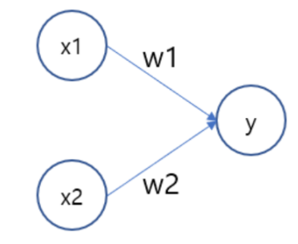
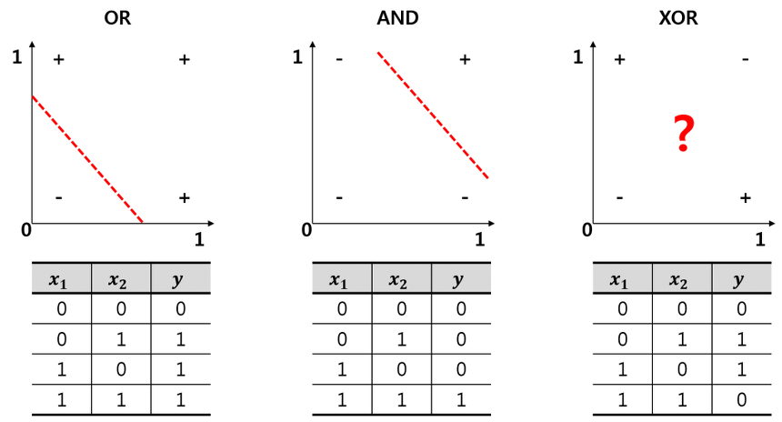

# Perceptron(퍼셉트론)

> 1957년 로젠블라트가 고안한 알고리즘이다. 이 알고리즘은 딥러닝의 기원이 되는 알고리즘이다.

## 퍼셉트론이란

* 다수의 신호를 입력으로 받아 하나의 신호를 출력한다.

* 신호는 흐른다/안 흐른다. (1 또는 0의 두가지 값을 가질 수 있다.) 

* 아래 그림에서 각 원을 **뉴런** 또는 **노드**라고 부른다.
 

* 입력 신호는 각각 고유한 **가중치**가 곱해지고 임계값 θ를 넘을때 1로 아니면 0으로 출력 된다. 정리하면 다음과 같은 수식이 된다.

* 가충치의 편항을 도입하면 다음과 같은 수식이 된다.

  

## 단순 논리 회로

* **AND** 게이트
|  a   |  b   | a & b |
| :--: | :--: | :---: |
|  0   |  0   |   0   |
|  1   |  0   |   0   |
|  0   |  1   |   0   |
|  1   |  1   |   1   |

* **NAND** 게이트
|  a   |  b   | ~(a & b) |
| :--: | :--: | :------: |
|  0   |  0   |    0     |
|  1   |  0   |    0     |
|  0   |  1   |    0     |
|  1   |  1   |    1     |

* **OR** 게이트
|  a   |  b   | a & b |
| :--: | :--: | :---: |
|  0   |  0   |   0   |
|  1   |  0   |   0   |
|  0   |  1   |   0   |
|  1   |  1   |   1   |

* **XOR** 게이트
|  a   |  b   | a  b |
| :--: | :--: | :----------------------------------------------------------: |
|  0   |  0   |                              0                               |
|  1   |  0   |                              1                               |
|  0   |  1   |                              1                               |
|  1   |  1   |                              0                               |

## 퍼셉트론의 한계

> **AND**, **OR**, **NAND** 게이트와 달리 **XOR** 의 경우 문제가 발생한다. 다음 그림을 통해 알아보자.

* 위의 **OR**, **AND** 그래프를 보면 **+,** **- ** 를  하나의 직선으로 분류할 수 있다. 그러나 **XOR**과 같은 경우는 하나의 직선으로 분류가 불가능하다.
* 이로 인해 Logistic Regression과 같이 선형 model을 이용해서 해결하는것이 불가능 하다.
* **다층** **퍼셉트론(Multi** **layer** **perceptron)**의 필요성이  대두된다. 

