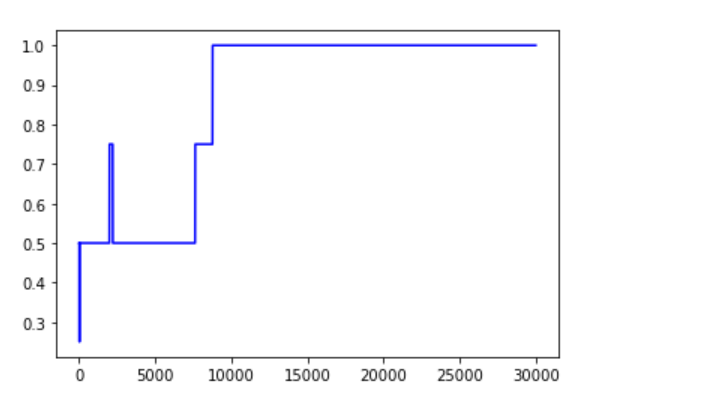

# XOR 학습시키기(TF2.xx)

> **TF2.xx**를 사용한 **DNN** 모델을 만든다.


## Library

> 사용한 **Library**를 나열한다.

```python
import numpy as np
import tensorflow as tf
import matplotlib.pyplot as plt

from tensorflow.keras.models import Sequential
from tensorflow.keras.layers import Dense
from tensorflow.keras.optimizers import SGD

from sklearn.metrics import classification_report
```


## 학습 진행

> `TF2.xx`로 학습을 진행해본다.

* **XOR** DataSet

```python
x_data = np.array([[0,0],[1,0],[0,1],[1,1]], dtype=np.float32)
t_data = np.array([[0],[1],[1],[0]], dtype=np.float32)
```


* model 및 layer 생성, compile

```python
keras_model = Sequential()

keras_model.add(Dense(100, activation='sigmoid', input_size=(x_data.shape[1],)))
# Flatten 없이 Dense로만 표한 가능하다.
keras_model.add(Dense(6, activation='sigmoid'))
keras_model.add(Dense(1, activation='sigmoid'))

keras_model.compile(optimizer=SGD,
                    loss='binary_crossentropy',
                    metrics=['accuracy'])
```


* 학습 진행

```python
history =keras_model.fit(x_data,
          	             t_data,
                		 epochs=30000,
	 	                 verbose=0)
```


* 결과

```python
predict_val = keras_model.predict(x_data)
print(classfication_report(t_data.ravel(), tf.cast(predict_val>=0.5, dtype=tf.float32 ).numpy().ravel()))
#               precision    recall  f1-score   support
# 
#          0.0       1.00      1.00      1.00         2
#          1.0       1.00      1.00      1.00         2
# 
#     accuracy                           1.00         4
#    macro avg       1.00      1.00      1.00         4
# weighted avg       1.00      1.00      1.00         4

```

* Accuracy 그래프

```python
plt.plot(history.history['accuracy'], color='b')
plt.show()
```


