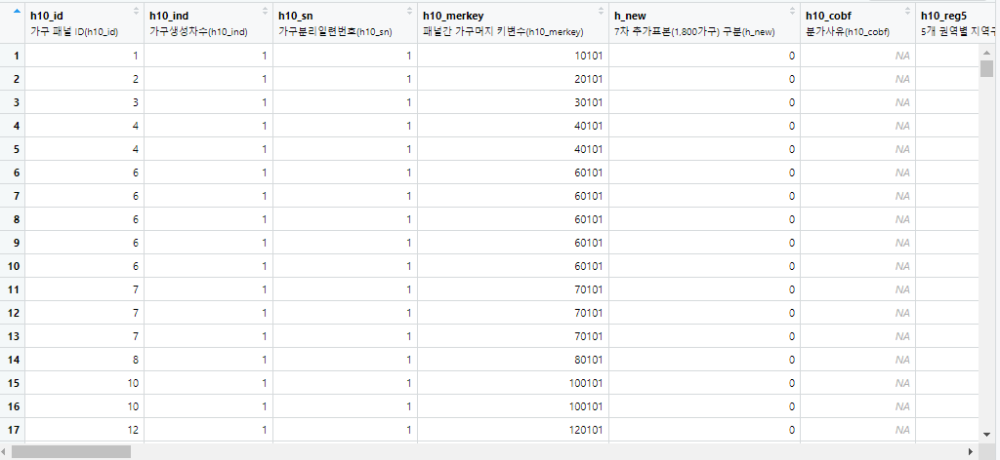

## 한국복지패널데이터(1)

> `한국인의 삶을 파악하라` 라는 주제로 데이터 분석을 실행한다.


### 데이터 분석 준비

* 패키지 설치 및 로드

  ```R
  install.packages('foreign') 
  
  library(foreign) # spass 파일 불러오기
  library(dplyr)   # 전처리
  library(ggplot2) # 시각화
  library(readxl)  # 엑셀 파일 불러오기
  ```


* 데이터 불러오기

  ```R
  raw_welfare <-read.spss(file='Koweps_hpc10_2015_beta1.sav', to.data.frame=T)
  
  welfare <- raw_welfare
  ```


* 데이터 살펴보기

  ```R
  View(welfare)
  ```

  

  ```R
  dim(welfare)
  # [1] 16664   957
  
  str(welfare)     # 결과 생략
  summary(welfare) # 결과 생략
  ```

  

* 변수명 변경

  ```R
  welfare <- rename(welfare,
                    sex=h10_g3,           # 성별     
                    birth=h10_g4,         # 생일 
                    marriage=h10_g10,     # 혼인 여부
                    religion=h10_g11,     # 종교
                    income=p1002_8aq1,    # 월급
                    code_job=h10_eco9,    # 직업 코드
                    code_region=h10_reg7) # 지역 코드
  ```

  

