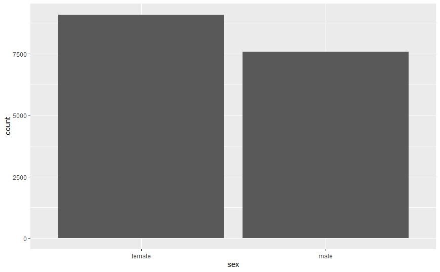
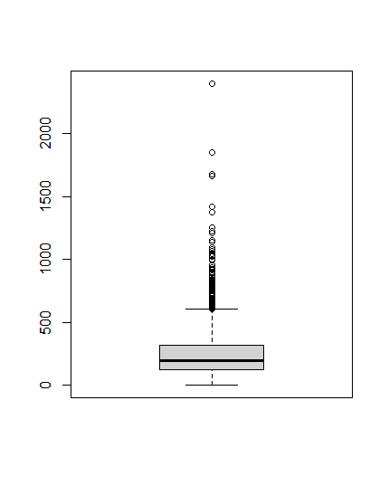
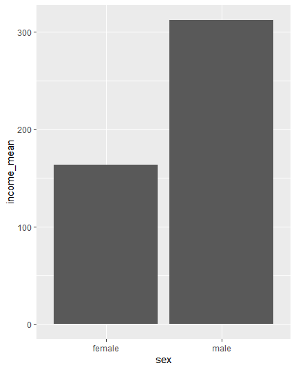

## 한국복지패널데이터(2)

> `한국인의 삶을 파악하라` 라는 주제로 데이터 분석을 실행한다.


### 성별에 따른 월급 차이

* 성별 데이터

  * 성별 데이터 타입 확인

    ```R
    class(welfare$sex)
    # [1] "numeric"
    ```

    

  * 결측치 확인

    ```R
    table(is.na(welfare$sex))
    # FALSE 
    # 16664
    ```

    * 결측치 없음

  * 이상치 확인

    ```R
    table(welfare$sex)
    # female   male 
    #   9086   7578 
    ```

    * 이상치 없음

  * 항목 이름 변경

    ```R
    welfare$sex <- ifelse(welfare$sex==1, 'male', 'female')
    ggplot(data=welfare, aes(x=sex)) + geom_bar()
    ```

    

  

  

* 수입 데이터

  * 수입 데이터 확인

    ```R
    class(welfare$income)
    # [1] "numeric"
    
    summary(welfare$income)
    #    Min. 1st Qu.  Median    Mean 3rd Qu.    Max.    NA's 
    #     0.0   122.0   192.5   241.6   316.6  2400.0   12030 
    
    boxplot(welfare$income)
    ```

    

  * 결측치 확인

    ```R
    table(is.na(welfare$income))
    # FALSE  TRUE 
    #  4634 12030 
    ```

  * 이상치 확인 : 정상 범주가(1~9998)이고 9999는 무응답이다. 따라서 0과 9999를 결측치로 처리한다.

    ```R
    welfare$income <- ifelse(welfare$income %in% c(0, 9999), NA, welfare$income)
    ```

    

* 성별에 따른 평균 월급 비교

  * 결과 확인

    ```R
    sex_income <- welfare %>%
    			  	group_by(sex) %>%
    				summarise(income_mean=mean(income, na.rm=T))
    sex_income
    ## ----- 결과 -----
    # A tibble: 2 x 2
      sex    income_mean
      <chr>        <dbl>
    1 female        163.
    2 male          312.
    ```

  * 시각화

    ```R
    ggplot(data=sex_income, aes(x=sex, y=income_mean)) + geom_col()
    ```

    

  