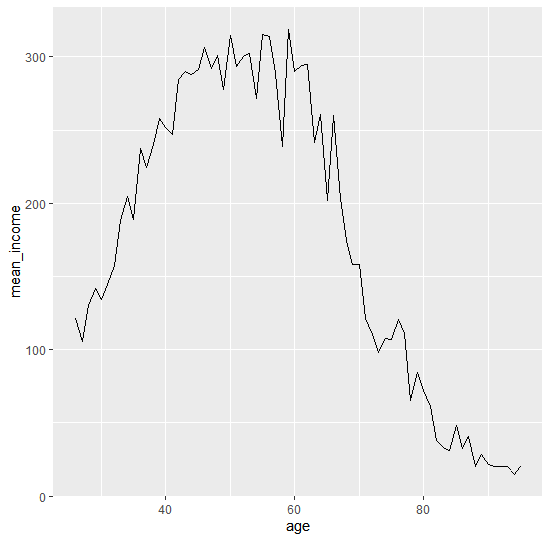

## 한국복지패널데이터(3)

> `한국인의 삶을 파악하라` 라는 주제로 데이터 분석을 실행한다.


### 나이에 따른 월급 관계

> 몇 살 때 월급을 가장 많이 받을까?


* 나이 데이터

  * 나이 데이터 타입 확인

    ```R
    class(welfare$birth)
    # [1] "numeric"
    ```

  * 결측치 확인

    ```R
    table(is.na(welfare$birth))
    # FALSE 
    # 16664
    ```

  * 이상치 확인

    ```R
    summary(welfare$birth)
    #    Min. 1st Qu.  Median    Mean 3rd Qu.    Max. 
    #    1907    1946    1966    1968    1988    2014 
    ```

    * Min, Max 값이 정상범위에 있는 것으로 보아 이상치는 없다.

  * `age` 컬럼 생성하기

    ```R
    welfare$age <- 2021 - welfare$birth + 1
    summary(welfare$age)
    #    Min. 1st Qu.  Median    Mean 3rd Qu.    Max. 
    #    8.00   34.00   56.00   54.43   76.00  115.00 
    ```

    

* 나이에 따른 수입

  ```R
  welfare$age <- welfare %>%
  			filter(!is.na(age)) %>%
  			group_by(age) %>%
  			summarise(mean_income=mean(income))
  
  welfare$age
  ## ------ 결과 ------
  # A tibble: 69 x 2
       age mean_income
     <dbl>       <dbl>
   1    26        121.
   2    27        106.
   3    28        130.
   4    29        142.
   5    30        134.
   6    31        145.
   7    32        158.
   8    33        188.
   9    34        205.
  10    35        189.
  # ... with 59 more rows
  ```

  ```R
  library(ggplot2)
  ggplot(data=age_income, aes(x=age, y=mean_income))+ geom_line()
  ```

  

