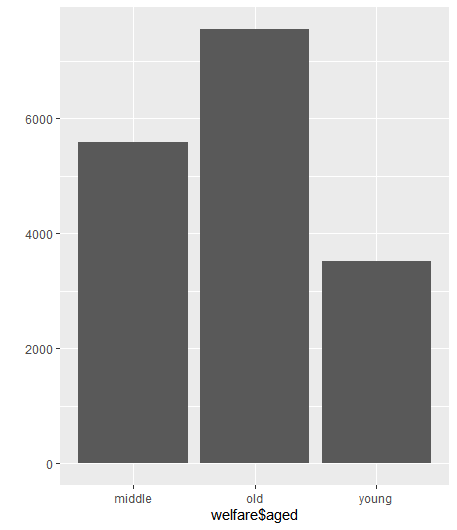
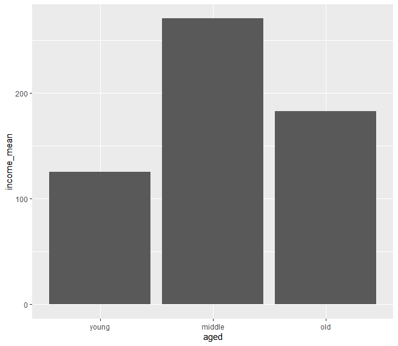

## 한국복지패널데이터(4)

> `한국인의 삶을 파악하라` 라는 주제로 데이터 분석을 실행한다.


### 연령대에 따른 월근 관계

> 어느 연령대가 월급을 가장 많이 받을까?


### 연령대 데이터 만들기

```R
welfare <- welfare %>% 
			mutate(aged=ifelse(age<30, 'young', ifelse(age<60, 'middle', 'old')))
table(welfare(aged))
# middle    old  young 
#   5585   7561   3518 

qplot(welfare$aged)
```




### 연령대 별 평균 월급

```R
aged_income <- welfare %>%
				filter(!is.na(income)) %>%
				group_by(aged) %>%
				summarise(income_mean=mean(income))
aged_income

## ------ 결과 ------
# A tibble: 3 x 2
  aged   aged_mean
  <chr>      <dbl>
1 middle      270.
2 old         183.
3 young       125.
```

```R
ggplot(data=aged_income, aes(x=aged, y=income_mean)) + geom_col() + scale_x_discrete(limits=c('young', 'middle', 'old'))
```



* 중년, 노년, 초년 순서로 돈을 많이 번다.