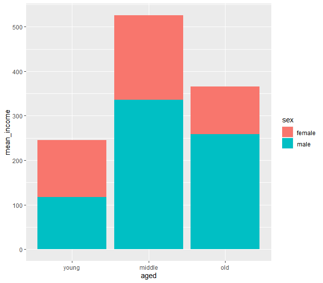
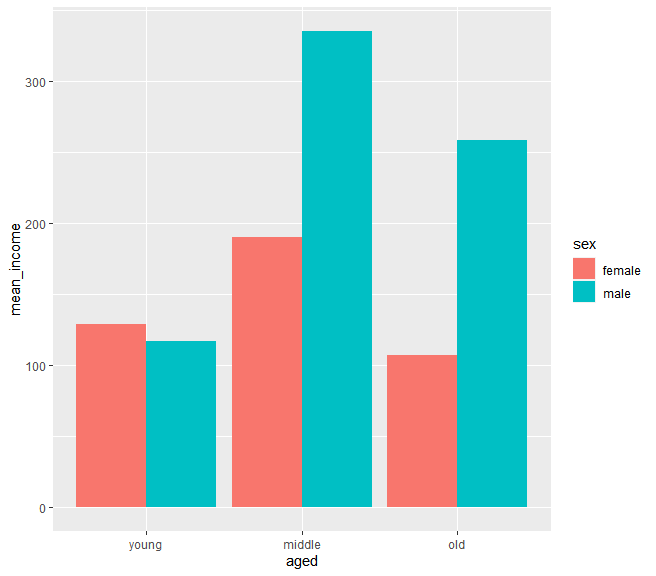
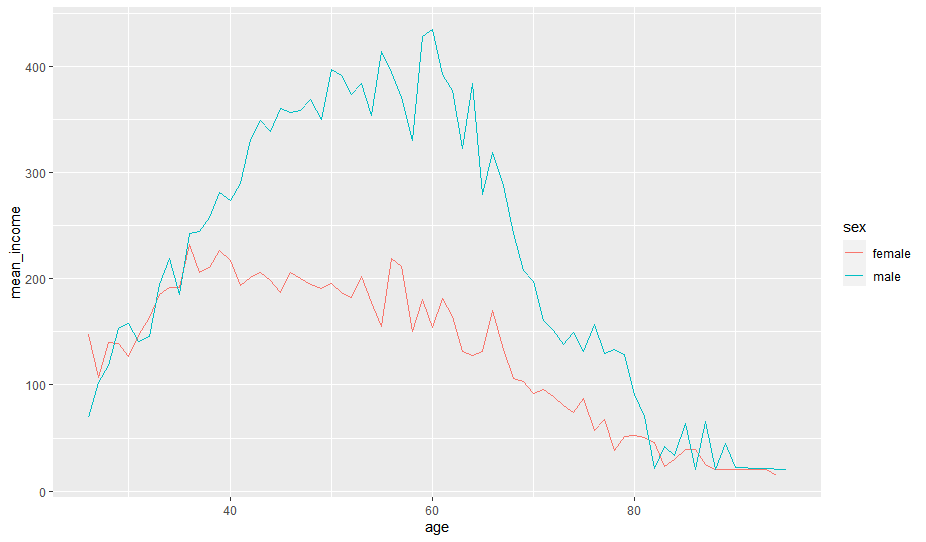

## 한국복지패널데이터(5)

> `한국인의 삶을 파악하라` 라는 주제로 데이터 분석을 실행한다.


### 연령, 성별에 따른 월근 관계

> 어느 연령대, 성별이 월급을 가장 많이 받을까?


### 연령, 성별 데이터 만들기

* 성별, 연령별 평균 수입

  ```R
  sex_aged_income <- welfare %>%
  	filter(!is.na(income)) %>%
  	group_by(sex, aged) %>%
  	summarise(mean_income=mean(income))
  sex_aged_income
  ## ------ 결과 ------
  # A tibble: 6 x 3
  # Groups:   sex [2]
    sex    aged   mean_income
    <chr>  <chr>        <dbl>
  1 female middle        191.
  2 female old           107.
  3 female young         129.
  4 male   middle        336.
  5 male   old           259.
  6 male   young         117.
  ```

* 그래프1

  ```R
  ggplot(data=sex_aged_income, aes(x=aged, y=mean_income, fill=sex)) + geom_col() + scale_x_discrete(limits=c('young', 'middle', 'old'))
  ```

  

* 그래프2

  ```R
  ggplot(data=sex_aged_income, aes(x=aged, y=mean_income, fill=sex)) + geom_col(position='dodge') + scale_x_discrete(limits=c('young', 'middle', 'old'))
  ```

  

### 나이, 성별 데이터 만들기

* 성별, 나이별 평균 수입

  ```R
  sex_age_income <- welfare %>%
  	filter(!is.na(income)) %>%
  	group_by(sex, age) %>%
  	summarise(mean_income=mean(income))
  sex_age_income
  ## ------ 결과 ------
  # A tibble: 134 x 3
  # Groups:   sex [2]
     sex      age mean_income
     <chr>  <dbl>       <dbl>
   1 female    26        147.
   2 female    27        107.
   3 female    28        140.
   4 female    29        139.
   5 female    30        126.
   6 female    31        147.
   7 female    32        163.
   8 female    33        185.
   9 female    34        191.
  10 female    35        192.
  # ... with 124 more rows
  ```

* 그래프

  ```R
  ggplot(data=sex_age_income, aes(x=age, y=mean_income, col=sex)) + geom_line()
  ```

  

