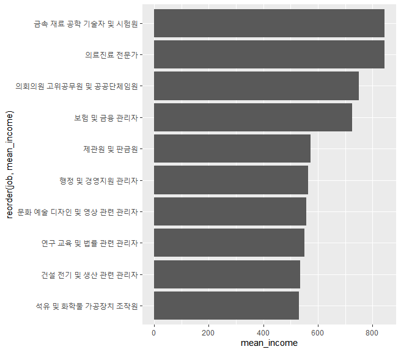
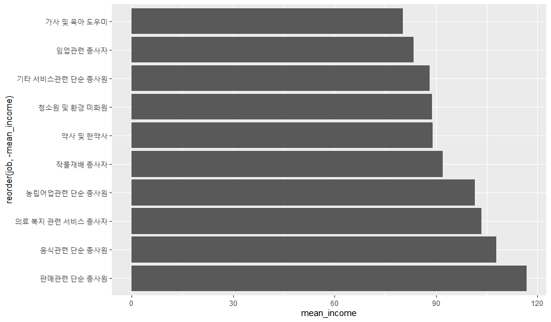

## 한국복지패널데이터(6)

> `한국인의 삶을 파악하라` 라는 주제로 데이터 분석을 실행한다.


### 직업에 따른 월근 관계

> 어느 직업이 월급을 가장 많이 받을까?


### 직업명을 포함하는 데이터프레임 만들기

```R
library(readxl)
list_job <- read_excel('Koweps_Codebook.xlsx', col_names=T, sheet=2)

head(list_job)
## A tibble: 6 x 2
#   code_job job                       
#      <dbl> <chr>                     
# 1      111 의회의원 고위공무원 및 공~
# 2      112 기업고위임원              
# 3      120 행정 및 경영지원 관리자   
# 4      131 연구 교육 및 법률 관련 관~
# 5      132 보험 및 금융 관리자       
# 6      133 보건 및 사회복지 관련 관~ 

dim(list_job)
# [1] 149   2

welfare <- left_join(welfare, list_job, id='code_job')
```


### 직업별 월급표 만들기

```R
job_income <- welfare %>%
    filter(!is.na(job) & !is.na(income)) %>%
    group_by(job) %>%
    summarise(mean_income=mean(income))

job_income
## ------ 결과 ------
# A tibble: 142 x 2
   job                    mean_income
   <chr>                        <dbl>
 1 가사 및 육아 도우미           80.2
 2 간호사                       241. 
 3 건설 및 광업 단순 종~        190. 
 4 건설 및 채굴 기계운전~       358. 
 5 건설 전기 및 생산 관~        536. 
 6 건설관련 기능 종사자         247. 
 7 건설구조관련 기능 종~        242. 
 8 건축 및 토목 공학 기~        378. 
 9 건축마감관련 기능 종~        254. 
10 경비원 및 검표원             134. 
# ... with 132 more rows
```


### 월급 상위 10개 직업

```R
top10 <- job_income %>%
    arrange(desc(mean_income)) %>%
    head(10)
top10
## ------ 결과 ------
# A tibble: 10 x 2
   job                    mean_income
   <chr>                        <dbl>
 1 금속 재료 공학 기술자~        845.
 2 의료진료 전문가               844.
 3 의회의원 고위공무원 ~         750 
 4 보험 및 금융 관리자           726.
 5 제관원 및 판금원              572.
 6 행정 및 경영지원 관리~        564.
 7 문화 예술 디자인 및 ~         557.
 8 연구 교육 및 법률 관~         550.
 9 건설 전기 및 생산 관~         536.
10 석유 및 화학물 가공장~        532.

ggplot(data=top10, aes(x=reorder(job, -mean_income), y=mean_income)) + geom_col() + coord_flip()
```




### 월급 하위 10개 직업

```R
bottom10 <- job_income %>%
	arrange(mean_income) %>%
	head(10)
## ------ 결과 ------
# A tibble: 10 x 2
   job                          mean_income
   <chr>                              <dbl>
 1 가사 및 육아 도우미                 80.2
 2 임업관련 종사자                     83.3
 3 기타 서비스관련 단순 종사원         88.2
 4 청소원 및 환경 미화원               88.8
 5 약사 및 한약사                      89  
 6 작물재배 종사자                     92  
 7 농립어업관련 단순 종사원           102. 
 8 의료 복지 관련 서비스 종사자       104. 
 9 음식관련 단순 종사원               108. 

ggplot(data=bottom10, aes(x=reorder(job, -mean_income), y=mean_income)) + geom_col() + coord_flip()
```

