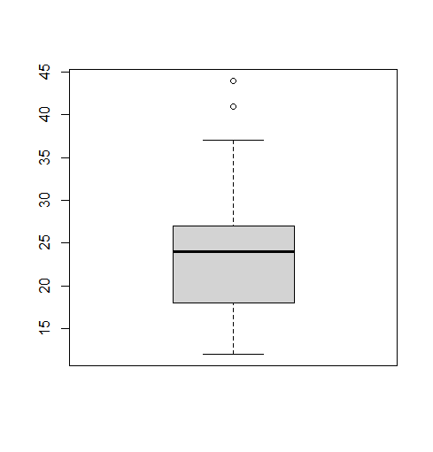

## 이상치 정제하기

> 이상치(정상 범주에서 크게 벗어난 값)는 오류는 아니지만 굉장히 극단적으로 발생하는 극단적인 값일 수 있다. 포함되면 결과가 왜곡되기 때문에 제거해야 할 경우가 생긴다.


### 이상치 결측치로 변환후 제외 후 평균 계산하기

* 데이터

  ```R
  outlier <- data.frame(sex=c(1, 2, 1, 3, 2, 1),
                        score=c(5, 4, 3, 4, 2, 6))
  outlier
  #   sex score
  # 1   1     5
  # 2   2     4
  # 3   1     3
  # 4   3     4
  # 5   2     2
  # 6   1     6
  ```

  * 성별의 경우 1, 2를 정상 범주로, 점수의 경우 1~5를 정상범주로 생각한다.

* 이상치 결측치 변환

  ```R
  outlier$sex <- ifelse(outlier$sex==3, NA, outlier$sex)
  outlier$score <- ifelse(outlier$score>5, NA, outlier$score)
  outlier
  #   sex score
  # 1   1     5
  # 2   2     4
  # 3   1     3
  # 4  NA     4
  # 5   2     2
  # 6   1    NA
  ```

* 결측치 제외하고 평균 계산

  ```R
  outlier %>%
  	filter(!is.na(sex) & !is.na(score)) %>%
  	group_by(sex) %>%
  	summarise(mean_score=mean(score))
  # # A tibble: 2 x 2
  #     sex mean_score
  #   <dbl>      <dbl>
  # 1     1          4
  # 2     2          3
  ```


### mpg 데이터 hwy 이상치 제외 평균 구하기

* 데이터 이상치 확인하기

  ```R
  mpg <- as.data.frame(ggplot2::mpg)
  boxplot(mpg$hwy)$stats
  #---------결과----------
       [,1]
  [1,]   12 # 아래쪽 극단치 경계
  [2,]   18 # 1사분위수
  [3,]   24 # 중앙값 
  [4,]   27 # 3사분위수
  [5,]   37 # 위쪽 극단치 경계
  ```

  

* 결측치로 처리하기

  ```R
  mpg$hwy <- ifelse(mpg$hwy>37 | mpg$hwy<12, NA, mpg$hwy)
  table(is.na(mpg$hwy))
  # FALSE  TRUE 
  #   231     3
  ```

* 결측치 제외하고 drv 별 hwy 평균 계산

  ```R
  mpg %>%
  	group_by(drv) %>%
  	summarise(hwy_mean=mean(hwy), na.rm=T)
  # ----- 결과 -----
  # A tibble: 3 x 2
    drv   hwy_mean
    <chr>    <dbl>
  1 4         19.2
  2 f         27.7
  3 r         21 
  ```

  

