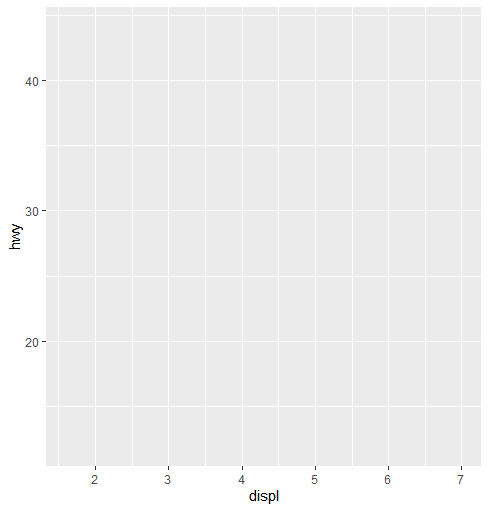
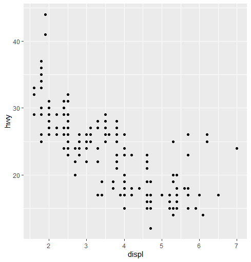
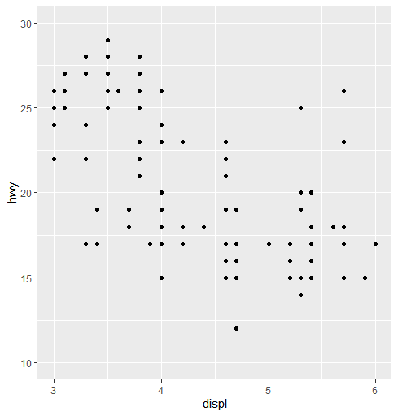

## ggplot2(1)

> `ggplot2`를 활용해 간단한 그래프를 그리는 방법에 대해 알아본다.


### ggplot2

* `ggplot2` 문법은 레이어 구조로 되어 있다.
* 레이어 구조는 다음과 같다.
  * 1단계 : 배경 만들기
  * 2단계 : 그래프 추가(점, 막대, 선)
  * 3단계 : 설정 추가(축 범위, 색, 표식)

* `ggplot2` 로드

  ```R
  library(ggplot2)
  ```

* `dplyr`의 연결은 `%>%`로 되는 반면,  `ggplot2`은 `+`로 연결된다.


### 산점도

* 1단계 : 배경 설정

  ```R
  # data는 mpg data, x축은 displ, y축은 hwy로 지정해 배경 설정
  ggplot(data=mpg, aes(x=displ, y=hwy))
  ```

  

* 2단계 : 그래프 추가

  ```R
  ggplot(data=mpg, aes(x=displ, y=hwy)) + geom_point()
  ```

  

* 3단계 : 축 범위 조정

  ```R
  ggplot(data=mpg, aes(x=displ, y=hwy)) + 
  	geom_point() + 
  	xlim(3, 6) + 
  	ylim(10, 30)
  ```

  

  * 그래프에 표시되지 않은 점들 때문에 다음과 같은 경고 메세지가 등장한다.

    ```R
    Warning message:
    Removed 105 rows containing missing values
    (geom_point).
    ```

    