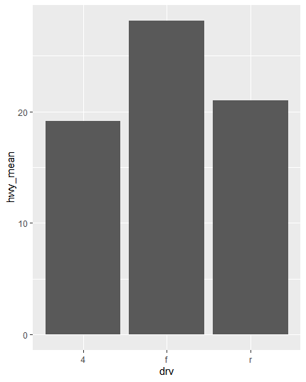
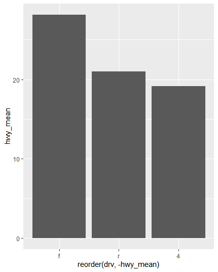
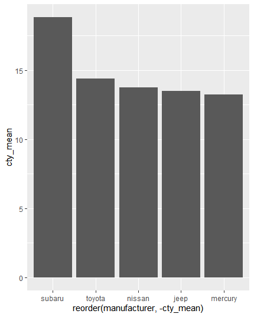
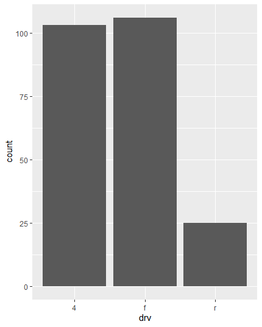
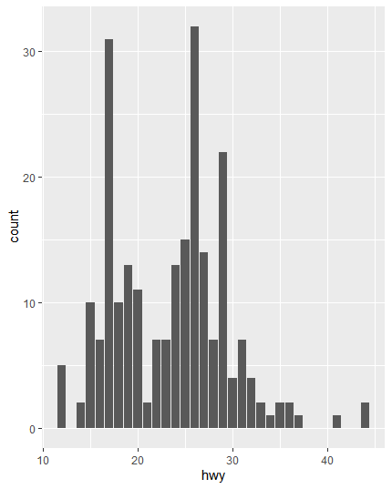

## ggplot2(2)

> `ggplot2`를 활용해 간단한 그래프를 그리는 방법에 대해 알아본다.


### 막대 그래프

* 평균 데이터 만들기

  ```R
  # 패키지 로드
  library(dplyr)
  
  # 데이터 만들기
  df_mpg <- mpg %>%
  	group_by(drv) %>%
  	summarise(hwy_mean=mean(hwy))
  df_mpg
  
  ## ----- 결과 -----
  # A tibble: 3 x 2
    drv   hwy_mean
    <chr>    <dbl>
  1 4         19.2
  2 f         28.2
  3 r         21  
  ```

  

* 막대 그래프 그리기

  ```R
  ggplot(data=df_mpg, aes(x=drv, y=hwy_mean)) + geom_col()
  ```

  

* 내림차순으로 그리기 : `reorder` 함수를 사용해 두 번째 인자에 기준을 주면 된다.

  ```R
  ggplot(data=df_mpg, aes(x=reorder(drv, -hwy_mean), y=hwy_mean)) + geom_col()
  ```

  

*  `suv` 차종의 `hwy`의 상위 5개 `manufacturer` 의 그래프 그리기

  * 평균 데이터 만들기

    ```R
    df <- mpg %>% 
    	filter(class=='suv') %>%
    	group_by(manufacturer) %>%
    	summarise(cty_mean=mean(cty)) %>%
    	arrange(desc(cty_mean)) %>%
    	head(5)
    
    df
    ## ----- 결과 -----
    # A tibble: 5 x 2
      manufacturer cty_mean
      <chr>           <dbl>
    1 subaru           18.8
    2 toyota           14.4
    3 nissan           13.8
    4 jeep             13.5
    5 mercury          13.2	
    ```

  * 그래프 그리기

    ```R
    ggplot(data=df, aes(x=reorder(manufacturer,-cty_mean), y=cty_mean)) + geom_col()
    ```

    

  


### 빈도 막대 그래프

* `drv` 데이터로 그리기

  ```R
  ggplot(data=mpg, aes(x=drv)) + geom_bar()
  ```

  

* `hwy` 데이터로 그리기

  ```R
  ggplot(data=mpg, aes(x=hwy)) + geom_bar()
  ```

  

