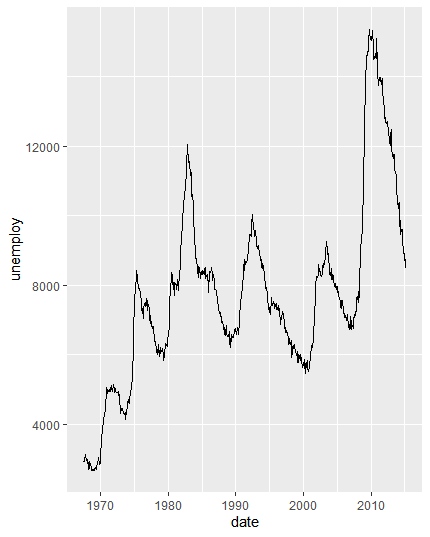
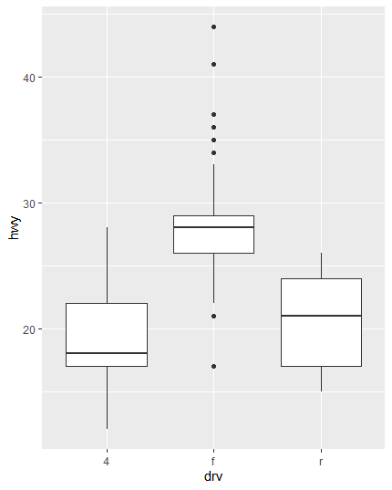

## ggplot2(3)

> `ggplot2`를 활용해 간단한 그래프를 그리는 방법에 대해 알아본다.


### 선 그래프

* 경제 데이터 시간에 따른 실업률 데이터

  ```R
  ggplot(data=economics, aes(x=date, y=unemploy)) + geomline
  ```

  


### 상자 그림

* `mpg` 데이터 `drv` 별 `hwy` boxplot

  ```R
  ggplot(data=mpg, aes(x=drv, y=hwy)) + geom_boxplot()
  ```

  

