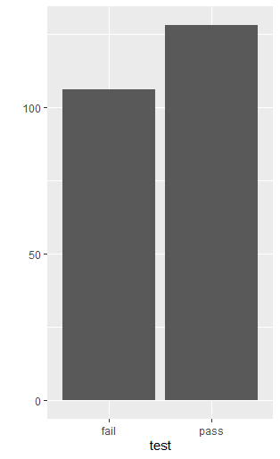
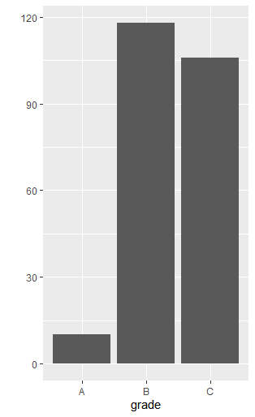

## ifelse

> if문의 한계를 해결하여 **벡터** **연산**(각 요소별 조건 검사)이 가능하다.


### mpg data

```R
mpg <- as.data.frame(ggplot2::mpg)
mpg$total <- (mpg$cty + mpg$hwy)/2
head(mpg)

  manufacturer model displ year cyl      trans drv cty hwy fl   class total
1         audi    a4   1.8 1999   4   auto(l5)   f  18  29  p compact  23.5
2         audi    a4   1.8 1999   4 manual(m5)   f  21  29  p compact  25.0
3         audi    a4   2.0 2008   4 manual(m6)   f  20  31  p compact  25.5
4         audi    a4   2.0 2008   4   auto(av)   f  21  30  p compact  25.5
5         audi    a4   2.8 1999   6   auto(l5)   f  16  26  p compact  21.0
6         audi    a4   2.8 1999   6 manual(m5)   f  18  26  p compact  22.0
```


### 사용법

* 단일 ifelse

  ```R
  ifelse(조건, 참 값, 거짓 값)
  ```

* 중첩 ifelse

  ```R
  ifelse(조건1, 참 값1, ifelse(조건2, 참 값2, 거짓 값))
  ```

  

### 예제

* 단일 ifelse

  ```R
  mpg$test <- ifelse(mpg$total>=20, 'pass', 'fail')
  head(mpg)
  manufacturer model displ year cyl      trans drv cty hwy fl   class total test
  # 1         audi    a4   1.8 1999   4   auto(l5)   f  18  29  p compact  23.5 pass
  # 2         audi    a4   1.8 1999   4 manual(m5)   f  21  29  p compact  25.0 pass
  # 3         audi    a4   2.0 2008   4 manual(m6)   f  20  31  p compact  25.5 pass
  # 4         audi    a4   2.0 2008   4   auto(av)   f  21  30  p compact  25.5 pass
  # 5         audi    a4   2.8 1999   6   auto(l5)   f  16  26  p compact  21.0 pass
  # 6         audi    a4   2.8 1999   6 manual(m5)   f  18  26  p compact  22.0 pass
  ```

  ```R
  table(mpg$test)
  # fail pass 
  #  106  128
  ```

  ```R
  library(ggplot)
  qplot(data=mpg, x=text)
  ```

  

* 중첩 예제

  ```R
  ifelse(mpg$total>=30, 'A', ifelse(mpg$total>=20, 'B', 'C'))
  ```

  * A : total 30이상, B : 20이상~29이하, C : 20미만

  ```R
  head(mpg, 10)
  #   manufacturer model displ year cyl      trans drv cty hwy fl   class total test grade
  # 1         audi    a4   1.8 1999   4   auto(l5)   f  18  29  p compact  23.5 pass     B
  # 2         audi    a4   1.8 1999   4 manual(m5)   f  21  29  p compact  25.0 pass     B
  # 3         audi    a4   2.0 2008   4 manual(m6)   f  20  31  p compact  25.5 pass     B
  # 4         audi    a4   2.0 2008   4   auto(av)   f  21  30  p compact  25.5 pass     B
  # 5         audi    a4   2.8 1999   6   auto(l5)   f  16  26  p compact  21.0 pass     B
  # 6         audi    a4   2.8 1999   6 manual(m5)   f  18  26  p compact  22.0 pass     B
  ```

  ```R
  table(mpg$grade)
  #   A   B   C 
  #  10 118 106 
  ```

  ```R
  qplot(data=mpg, x=grade)
  ```

  

* 삼중첩

  ```R
  mpg$grade2 <- ifelse(mpg$total>=30, 'A', 
                       ifelse(mpg$total>=25, 'B', 
                              ifelse(mpg$total>=20, 'C', 'D')))
  ```

  

