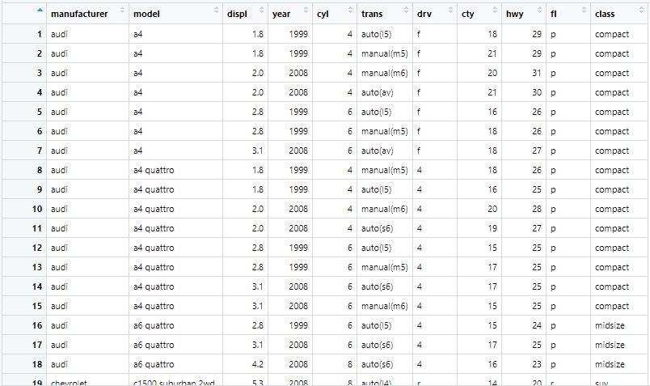

## 데이터 파악 방법

> `head`, `tail`, `View`, `dim`, `str`, `summary`


### Data

```R
mpg <- as.data.frame(ggplot2::mpg)
```


### head와 tail

* head : 최상위 6개의 데이터를 보여준다.

  ```R
  head(mpg)
  #   manufacturer model displ year cyl      trans drv cty hwy fl   class
  # 1         audi    a4   1.8 1999   4   auto(l5)   f  18  29  p compact
  # 2         audi    a4   1.8 1999   4 manual(m5)   f  21  29  p compact
  # 3         audi    a4   2.0 2008   4 manual(m6)   f  20  31  p compact
  # 4         audi    a4   2.0 2008   4   auto(av)   f  21  30  p compact
  # 5         audi    a4   2.8 1999   6   auto(l5)   f  16  26  p compact
  # 6         audi    a4   2.8 1999   6 manual(m5)   f  18  26  p compact
  ```

  ```R
  head(mpg, 2)
  #   manufacturer model displ year cyl      trans drv cty hwy fl   class
  # 1         audi    a4   1.8 1999   4   auto(l5)   f  18  29  p compact
  # 2         audi    a4   1.8 1999   4 manual(m5)   f  21  29  p compact
  ```

  * 디폴트= 6을 변경할 수 있다.

* tail : 최하위 컬럼 6개를 보여준다. 마찬가지로 디폴트는 다음인자에 원하는 개수를 써주어 변경가능하다.

  ```R
  tail(mpg)
  #     manufacturer  model displ year cyl      trans drv cty hwy fl   class
  # 229   volkswagen passat   1.8 1999   4   auto(l5)   f  18  29  p midsize
  # 230   volkswagen passat   2.0 2008   4   auto(s6)   f  19  28  p midsize
  # 231   volkswagen passat   2.0 2008   4 manual(m6)   f  21  29  p midsize
  # 232   volkswagen passat   2.8 1999   6   auto(l5)   f  16  26  p midsize
  # 233   volkswagen passat   2.8 1999   6 manual(m5)   f  18  26  p midsize
  # 234   volkswagen passat   3.6 2008   6   auto(s6)   f  17  26  p midsize
  ```


### View

- 표로 깔끔히 정리된 데이터를 볼 수 있다.

  ```R
  View(mpg)
  ```

  

  


### dim

* 차원(행의 개수, 열의 개수)를 알려준다.(`pandas`에서 `.shape`)

  ```R
  dim(mpg)
  # [1] 234  11
  ```


### str

* 열 데이터 값들과 type을 알려준다.(`pandas`에서 `.info`)

  ```R
  str(mpg)
  # 'data.frame':	234 obs. of  11 variables:
  #  $ manufacturer: chr  "audi" "audi" "audi" "audi" ...
  #  $ model       : chr  "a4" "a4" "a4" "a4" ...
  #  $ displ       : num  1.8 1.8 2 2 2.8 2.8 3.1 1.8 1.8 2 ...
  #  $ year        : int  1999 1999 2008 2008 1999 1999 2008 1999 1999 2008 ...
  #  $ cyl         : int  4 4 4 4 6 6 6 4 4 4 ...
  #  $ trans       : chr  "auto(l5)" "manual(m5)" "manual(m6)" "auto(av)" ...
  #  $ drv         : chr  "f" "f" "f" "f" ...
  #  $ cty         : int  18 21 20 21 16 18 18 18 16 20 ...
  #  $ hwy         : int  29 29 31 30 26 26 27 26 25 28 ...
  #  $ fl          : chr  "p" "p" "p" "p" ...
  #  $ class       : chr  "compact" "compact" "compact" "compact" ...
  ```

  

### summary

* 컬럼이 수치값이면 대한 평균, 최대, 최소 1사분위값, 중위값 3사분위값을 알려준다. 즉, 요약통계랑을 알려준다.

  ```R
  summary(mpg[1:5])
  #  manufacturer          model               displ            year           cyl       
  #  Length:234         Length:234         Min.   :1.600   Min.   :1999   Min.   :4.000  
  #  Class :character   Class :character   1st Qu.:2.400   1st Qu.:1999   1st Qu.:4.000  
  #  Mode  :character   Mode  :character   Median :3.300   Median :2004   Median :6.000  
  #                                        Mean   :3.472   Mean   :2004   Mean   :5.889  
  #                                        3rd Qu.:4.600   3rd Qu.:2008   3rd Qu.:8.000  
  #                                        Max.   :7.000   Max.   :2008   Max.   :8.000  
  ```

