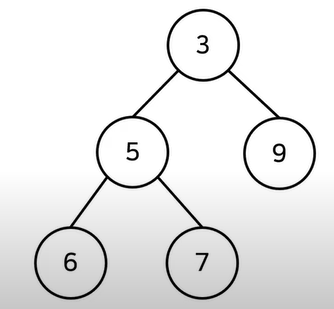
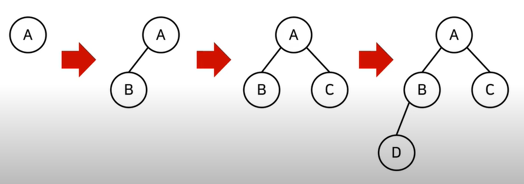
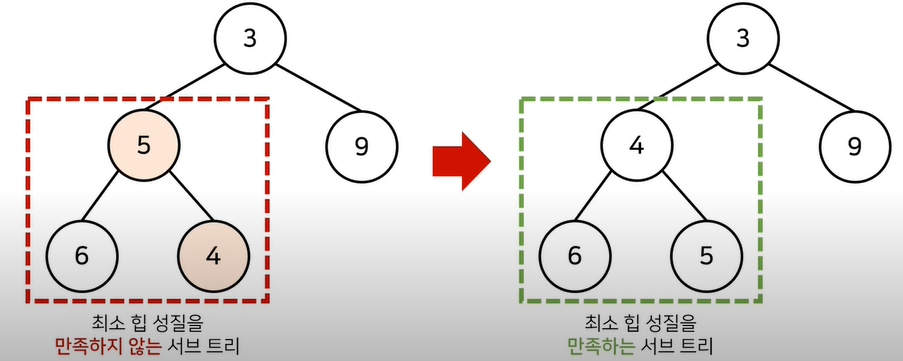
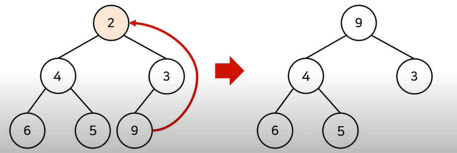
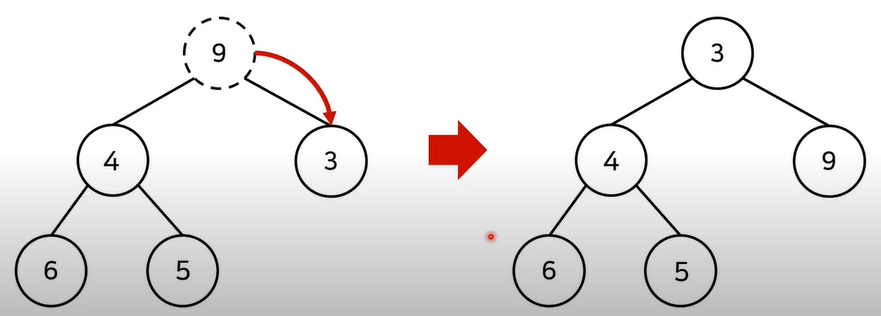

# Prioirity Queue

> 우선순위 큐는 `우선순위`가 가장 높은 데이터를 가장 먼저 삭제하는 자료구조이다.


* 구현 방법

  * 단순한 리스트를 이용한다.
  * 힙(heap)을 이용한 구현한다.

  | 우선순위 큐 구현 방식 | 삽입 시간 | 삭제 시간 |
  | --------------------- | --------- | --------- |
  | 리스트(list)          | O(1)      | O(N)      |
  | 힙(heap)              | O(logN)   | O(logN)   |

* 단순히 N개의 데이터를 힙에 넣었다가 모두 꺼내는 작업은 정렬과 동일하다.(힙 정렬)

  * 시간 복잡도 O(NlogN)


## 힙(heap)

> 힙은 완전 이진 트리 자료구조의 일종이다.

* 힙에서는 항상 루트 노트(root node)를 제거한다.
* 최소 힙(min heap)
  * 루트 노드가 가장 작은 값을 가진다.
  * 값이 가장 작은 데이터가 우선적으로 제거된다.



 

* 최대 힙(max heap)
  * 루트 노드가 가장 큰 값을 가진다.
  * 값이 큰 데이터가 우선적으로 제거된다.


## 완전 이진 트리

> 루트 노드부터 왼쪽 자식 노드, 오른쪽 자식 노드 순서대로 데이터가 차례대료 삽입되는 트리(tree)를 말한다.




## 최소 힙 구성 함수(Min-Heapify())

> 최소 힙의 성질을 가지도록 만들어 주는 함수

* 상향식 : 아래부터 부모 노드랑 값을 비교하면서 바꿔준다.



* 새로운 원소가 들어왔을 때 O(logN)의 시간 복잡도로 힙 성질을 유지하게 한다.


* 원소가 제거될 때 O(logN)의 시간 복잡도로 힙 성질을 유지하게 한다.

  * 원소를 제거할 때는 가장 마지막 루트 노드의 위치에 오도록 한다.

    

  * 이후에 루트 노드에서 하향식으로(더 작은 자식 노드로) Heapify()를 진행한다.

    


## 우선순위 큐 라이브러리를 활용한 힙 정렬

```python
import heapq

def heapsort(iterable):

    h = []
    result = []
    
    for value in iterable:
        heapq.heappush(h, value)
        
    for i in range(len(h)):
        result.append(heapq.heappop(h))
    return result
```

