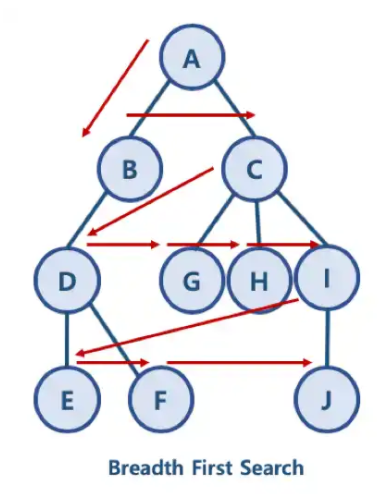

# Breadth-First Search (너비 우선 탐색)

> 대표적인 그래프 탐색 알고리즘인 너비 우선 탐색에 대해서 알아본다.



## BFS 구현 방법

* 위의 그래프를 BFS 방식으로 탐색해보면 위의 빨간색 방향과 같이

  A-B-C-D-G-H-I-E-F-J 가 된다. (BFS 알고리즘에서 최종 출력값이다.)

*  위의 그래프를 `dictionary`와 `list` 자료 구조를 활용하여 주로 나타낼 수 있다.

| key  | valuess |      |      |      |      |
| ---- | ------- | ---- | ---- | ---- | ---- |
| A    | B       | C    |      |      |      |
| B    | A       | D    |      |      |      |
| C    | A       | G    | H    | I    |      |
| D    | B       | E    | F    |      |      |
| E    | D       |      |      |      |      |
| F    | D       |      |      |      |      |
| G    | C       |      |      |      |      |
| H    | C       |      |      |      |      |
| I    | C       | J    |      |      |      |
| J    | I       |      |      |      |      |

  ```python
graph_list = {'A':(['B','C']),
              'B':(['A','D']),
              'C':(['A','G','H','I']),
              'D':(['B','E','F']),
              'E':(['D']),
              'F':(['D']),
              'G':(['C']),
              'H':(['C']),
              'I':(['C','J']),
              'J':(['I'])}
  ```

* 주로 `queue` 자료 구조를 사용한다.


## BFS 알고리즘 코드

> 앞으로 base로 쓸 `bfs` 함수 코드를 정리한다.

```python
from collections import deque

def bfs(graph_list, start_node):
    visited = []
    need_visit = deque([start_node])

    while need_visit:
        node = need_visit.popleft()
        if node not in visited:
            visited.append(node)
            need_visit.extend(graph_list[node])

    return visited
```

* `from collections import deque` : `list` 자료 구조를 사용해도 되지만 속도면에서 deque를 사용한다.

* `def bfs(graph_list, start_node)`  : `graph` 및 `start_node`(root node)를 input으로 받는다.
* `need_visit.extend(graph_list[node])` : 사실상 `visited` 를 고려하지 않고 `need_visit` 에 원소를 추가한다.

  

## BFS 알고리즘 코드2 (코드 더 개선 필요)

```python
from collections import deque
def bfs(graph_list, start_node):
    visited = []
    need_visit = deque([start_node])

    while need_visit:
        node = need_visit.popleft()
        if node not in visited:
            visited.append(node)
            need_visit.extend([ m for m in graph_list[node] if m not in visited])

    return visited
```


## 결과

```python
start_node = 'A'
print(bfs(graph_list, start_node))
# ['A', 'B', 'C', 'D', 'G', 'H', 'I', 'E', 'F', 'J']

```


