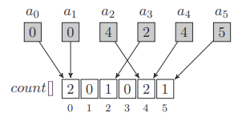
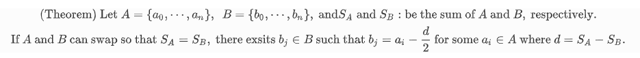

# Chapter4. Counting elements

> 원소가 각각 몇개가 있는지 알아내는 알고리즘에 대해서 알아본다.

일반적으로 `collections`에 있는 `Counter`를 사용하면 쉽게 주어진 `array`에 각 원소가 몇개씩 쉽게 알 수 있지만 변형하기가 쉽지 않다. 따라서 원소의 개수를 알아내는 알고리즘에 관해 알아본다.




## 1. array를 이용한 원소 counting 방법

> 이 방법의 경우 모든 배열의 원소들이 {0, 1, 2,...,m} 안에 있다고 가정한다.  즉 m+1개의 원소들의 각각의 개수들을 찾는 방법이다.

```python
def counting(A, m):
	
    n = len(A)
    check = [0] * (m+1)
    for i in range(n):
        check[A[i]] += 1
    return check
```

시간 복잡도의 경우 O(n+m)이다.

그러나 이 알고리즘의 단점은 이용가능한 메모리이다. 일반적으로 10**9 이상의 array의 경우 1 gigabyte가 넘기 때문에 를 만들 수 없다.


* 음수를 포함 하는경우

1. 모든 원소가 0 이상이 되도록 적당히 큰 수를 모든 원소에 더해주고 counting 하는 방법이 있다.
2. 음수에 관한 array와 양수에 관한 array를 각각 만들어 counting 하는 방법이 있다.


## Exercise

1이상 10**6 이하의 m 이 주어지고 n개의 정수로 이루어진 두개의 array A, B 가 주어진다.

여기서 A, B의 원소들은 0이상 m이하의 값이다.

A, B 의 원소들중 한번에 하나씩 교환할 때 A와 B의 합이 같아지는 경우가 생긴다면 `True`를, 없다면 `False`를 리턴해주면 된다.


1.  사전에 array A와 B의 합을 `sum_A`와 `sum_B` 를 계산해두고 교환하는 A, B들의 원소의 차이만큼 `sum_A`, `sum_B`에 차이만큼 보상해줘 구하는 방법이다. 최악의 경우 두개의 for문이 다 돌아야 하기 때문에 O(n**2) 만큼의 시간 복잡도를 지닌다.

```python
def slow_solution(A, B, m):

    n = len(A)
    sum_A = sum(A)
    sum_B = sum(B)
    for i in range(n):
        for j in range(n):
            diff = A[i] - B[i]
           	sum_A -= diff
            sum_B += diff
            if sum_A == sum_B:
                return True
     return False
```


2.  이 방법 역시 사전에 A집합의 합과 B집합의 합 `sum_a`와 `sum_b` 를 이용해  문제를 해결 한다. 두 차이가 만약 홀수이면 0.5씩 나눠가져야 하는 상황이 발생하므로 불가능하고 짝수인 경우 적당한 수가 한집합에 들어가는 것만 확인하면 된다.

   

   코드는 위의 내용을 이용해 만들어졌다.

```python
def fast_solution(A, B, m):
    n = len(A)
    sum_a = sum(A)
    sum_b = sum(B)
    diff = sum_a - sum_b
    if diff%2 == 1:
        return False
    diff //= 2
    count = counting(B, m) # 1번에서 정의한 함수
    for i in range(n):
        if (0 <= A[i] - diff <= m) and (count[A[i] -diff] > 0):
            return True
    return False
```

$$
%\text{(Theorem) }\text{Let }A=\{a_0 ,\cdots, a_n \},~~ B=\{b_0,\cdots, b_n \},~\text{and} 
%S_A~ \text{and}~ S_B : \text{be the sum of }A~\text{and}~B, \text{ respectively.}\\ \text{If } A \text{ and } B \text{ can swap so that }S_A=S_B, \text{ there exsits }b_j \in B \text{ such that }b_j=a_i - \frac{d}{2} \text{ for some }a_i\in A \text{ where } d=S_A-S_B.
$$


