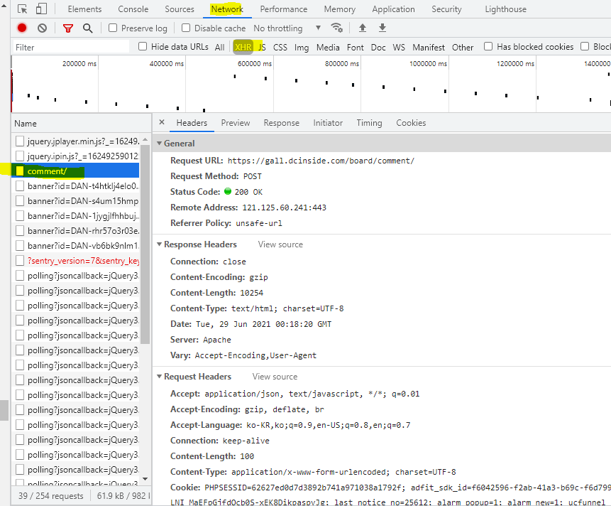
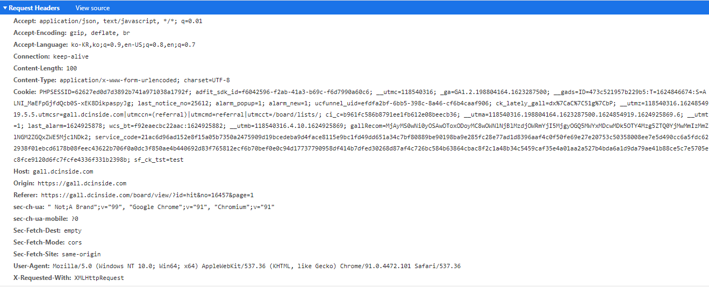
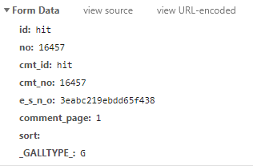
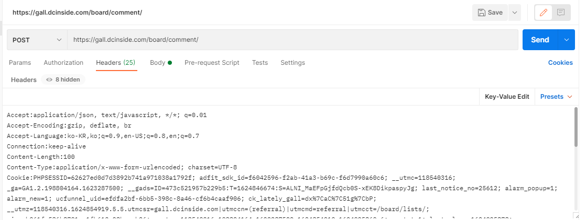
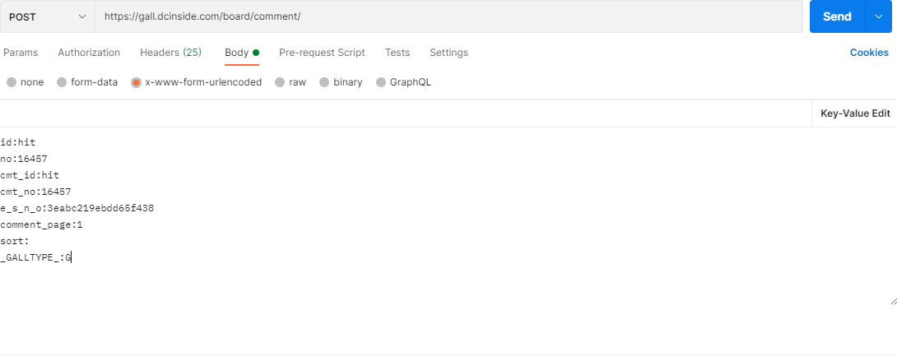
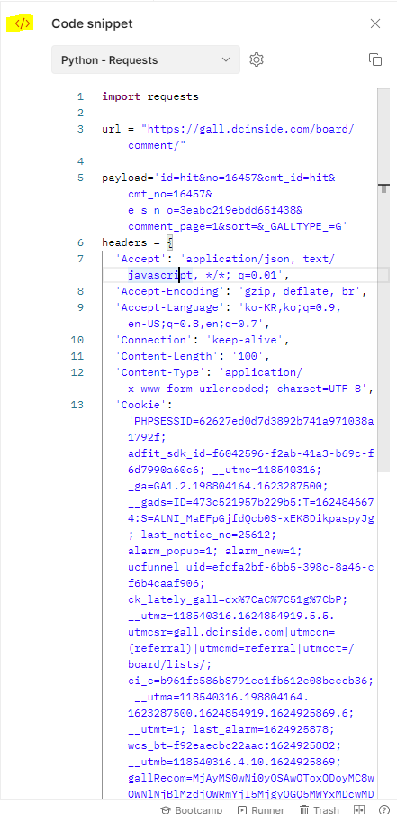

# DC 갤러리 댓글 수집

> Postman을 활용해 댓글 관련 json 정보를 얻고 python 코드까지 만든다.


### 필요 정보

* 검사 화면

  

  * Network의 XHR 선택후 comment/ 클릭


* request header

  

* Form Data

  


### Postman

* 입력 데이터1 : Headers

  

  * Headers : Bulk Edit(Key-Value Edit) 클릭후 ctrl + c, v
  * : 다음 띄어쓰기 제거하는게 좋다.

* 입력 데이터 2 :Body

  

* 코드 생성

  

  * 이를 활용해 python에서 데이터를 불러올 수 있다.

* 결과 데이터

  ```json
  {"total_cnt":318,"comment_cnt":0,"comments":[{"no":"4878040","parent":"16457","user_id":"","name":"\u3147\u3147","ip":"175.209","reg_date":"06.26
  03:25:05","nicktype":"00","t_ch1":"0","t_ch2":"0","vr_type":"","voice":null,"rcnt":"19","c_no":0,"depth":0,"del_yn":"N","is_delete":"0","memo":"\ub098\ub294
  \uc874\ub098 \uc774\ud574 \uc548\ub418\ub294\uac8c \ubcc4\uc774\ub77c\ub294\uac8c \uc8c4\ub2e4
  \ub3d9\uadf8\ub77c\uc774\ubbf8\uc784 \uc528\ubc1c\u314b\u314b\u314b\u314b \ub124\ubaa8\ubcc4 \ubfb0\uc871\ubcc4
  \uae38\ucb49\ubcc4 \ud558\ub098\ub3c4 \uc5c6\uace0 \uc8c4\ub2e4 \ub3d9\uadf8\ub77c\ubbf8 \uc0ac\uae30\ub3c4
  \uc815\ub3c4\uaecf
  \uccd0\uc57c\uc9c0","my_cmt":"N","del_btn":"Y","mod_btn":"N","a_my_cmt":"N","reply_w":"Y","gallog_icon":"<span class=\"nickname\"><em title = \"\u3147\u3147\">\u3147\u3147<\/em><span class=\"ip\">(175.209)<\/span><\/span>","vr_player":false,"vr_player_tag":""},{"no":"4878142","parent":"16457","user_id":"","name":"\u3147\u3147","ip":"175.203","reg_date":"06.26 09:59:53","nicktype":"00","t_ch1":"","t_ch2":"","vr_type":"","voice":null,"rcnt":"19","c_no":"4878040","depth":1,"del_yn":"N","is_delete":"0","memo":"\ub2f9\uc5f0\ud55c\uac70\uc9c0 \ub9cc\uc720\uc778\ub825\uc5d0 \uc758\ud574\uc11c \ubb49\uce58\ub294\ub370","my_cmt":"N","del_btn":"Y","mod_btn":"N","a_my_cmt":"N","reply_w":"Y","gallog_icon":"<span class=\"nickname\"><em title = \"\u3147\u3147\">\u3147\u3147<\/em><span class=\"ip\">(175.203)<\/span><\/span>","vr_player":false,"vr_player_tag":""},{"no":"4878650","parent":"16457","user_id":"","name":"\u3147\u3147","ip":"122.43","reg_date":"06.26 10:36:01","nicktype":"00","t_ch1":"0","t_ch2":"0","vr_type":"","voice":null,"rcnt":"19","c_no":"4878040","depth":1,"del_yn":"N","is_delete":"0","memo":"\ub098\ub3c4 \uc874\ub098 \uc774\ud574 \uc548\ub418\ub294\uac8c \ubb38\uacfc\uc0c8\ub07c\ub294 \uc8c4\ub2e4 \uc774\ubaa8\uc591\uc784 \u314b\u314b  - dc App","my_cmt":"N","del_btn":"Y","mod_btn":"N","a_my_cmt":"N","reply_w":"Y","gallog_icon":"<span class=\"nickname\"><em title = \"\u3147\u3147\">\u3147\u3147<\/em><span class=\"ip\">(122.43)<\/span><\/span>","vr_player":false,"vr_player_tag":""},{"no":"4879126","parent":"16457","user_id":"","name":"\u3147\u3147","ip":"182.211","reg_date":"06.26 13:31:07","nicktype":"00","t_ch1":"","t_ch2":"","vr_type":"","voice":null,"rcnt":"19","c_no":"4878040","depth":1,"del_yn":"N","is_delete":"0","memo":"\u3145\u3142\u314b\u314b\u314b\u314b\u314b\u314b\u314b","my_cmt":"N","del_btn":"Y","mod_btn":"N","a_my_cmt":"N","reply_w":"Y","gallog_icon":"<span class=\"nickname\"><em title = \"\u3147\u3147\">\u3147\u3147<\/em><span class=\"ip\">(182.211)<\/span><\/span>","vr_player":false,"vr_player_tag":""},{"no":"4879369","parent":"16457","user_id":"","name":"\u3147\u3147","ip":"122.202","reg_date":"06.26 15:55:54","nicktype":"00","t_ch1":"","t_ch2":"","vr_type":"","voice":null,"rcnt":"19","c_no":"4878040","depth":1,"del_yn":"N","is_delete":"0","memo":"\uc774\uac74 \ucc10\uac19\ub178","my_cmt":"N","del_btn":"Y","mod_btn":"N","a_my_cmt":"N","reply_w":"Y","gallog_icon":"<span class=\"nickname\"><em title = \"\u3147\u3147\">\u3147\u3147<\/em><span class=\"ip\">(122.202)<\/span><\/span>","vr_player":false,"vr_player_tag":""},{"no":"4879403","parent":"16457","user_id":"","name":"\u3147\u3147","ip":"112.164","reg_date":"06.26 16:16:23","nicktype":"00","t_ch1":"","t_ch2":"","vr_type":"","voice":null,"rcnt":"19","c_no":"4878040","depth":1,"del_yn":"N","is_delete":"0","memo":"\uc9c4\uc9c0\ud558\uac8c \ubb38\uacfc\uc0c8\ub07c\ub4e4\uc740 \uc804\ubd80 \uac00\uc2a4\uc2e4 \ub123\uc5b4\uc57c \ud55c\ub2e4","my_cmt":"N","del_btn":"Y","mod_btn":"N","a_my_cmt":"N","reply_w":"Y","gallog_icon":"<span class=\"nickname\"><em title = \"\u3147\u3147\">\u3147\u3147<\/em><span class=\"ip\">(112.164)<\/span><\/span>","vr_player":false,"vr_player_tag":""},{"no":"4879860","parent":"16457","user_id":"dcin123456","name":"\ub9dd\uac00","ip":"","reg_date":"06.26 21:48:14","nicktype":"20","t_ch1":"0","t_ch2":"0","vr_type":"","voice":null,"rcnt":"19","c_no":"4878040","depth":1,"del_yn":"N","is_delete":"0","memo":"\uc911\ub825 \ubaa8\ub974\ub0d0?","my_cmt":"N","del_btn":"Y","mod_btn":"N","a_my_cmt":"N","reply_w":"Y","gallog_icon":"<span class='nickname in' title='\ub9dd\uac00'  ><em>\ub9dd\uac00<\/em><\/span><a class='writer_nikcon'><\/a>","vr_player":false,"vr_player_tag":""},{"no":"4880026","parent":"16457","user_id":"kyosho06","name":"\uc774\uc05c\ub9d0\uc744\uc501\uc2dc\ub2e4","ip":"","reg_date":"06.27 01:15:48","nicktype":"20","t_ch1":"0","t_ch2":"0","vr_type":"","voice":null,"rcnt":"19","c_no":"4878040","depth":1,"del_yn":"N","is_delete":"0","memo":"\ubb38\uacfc\uc528 \ucd94\ud665\ub2c8\ub2e4  - dc App","my_cmt":"N","del_btn":"Y","mod_btn":"N","a_my_cmt":"N","reply_w":"Y","gallog_icon":"<span class='nickname in' title='\uc774\uc05c\ub9d0\uc744\uc501\uc2dc\ub2e4'  ><em>\uc774\uc05c\ub9d0\uc744\uc501\uc2dc\ub2e4<\/em><\/span><a class='writer_nikcon'><\/a>","vr_player":false,"vr_player_tag":""},{"no":"4880129","parent":"16457","user_id":"","name":"\u3147\u3147","ip":"218.154","reg_date":"06.27 03:54:09","nicktype":"00","t_ch1":"0","t_ch2":"0","vr_type":"","voice":null,"rcnt":"19","c_no":"4878040","depth":1,"del_yn":"N","is_delete":"0","memo":"\ubb38\uacfc\ub3c4 \uc544\ub294 \uc0ac\uc2e4\uc774\ub2c8\uae4c \uc131\uae09\ud55c \uc77c\ubc18\ud654\uc758 \uc624\ub958 \uc800\uc9c0\ub974\uc9c0 \ub9c8\ub77c \uc774 \uc528\ube68\uc0c8\ub07c\ub4e4\uc544!!!!!!!!!!!!!!!!!!!!!!!!!!","my_cmt":"N","del_btn":"Y","mod_btn":"N","a_my_cmt":"N","reply_w":"Y","gallog_icon":"<span class=\"nickname\"><em title = \"\u3147\u3147\">\u3147\u3147<\/em><span class=\"ip\">(218.154)<\/span><\/span>","vr_player":false,"vr_player_tag":""},
  .... 생략
  ```


### 파이썬

* 위에서 받은 코드

  ```python
  import requests
  import json
  
  url = "https://gall.dcinside.com/board/comment/"
  
  payload='id=hit&no=16457&cmt_id=hit&cmt_no=16457&e_s_n_o=3eabc219ebdd65f438&comment_page=1&sort=&_GALLTYPE_=G'
  headers = {
    'Accept': 'application/json, text/javascript, */*; q=0.01',
    'Accept-Encoding': 'gzip, deflate, br',
    'Accept-Language': 'ko-KR,ko;q=0.9,en-US;q=0.8,en;q=0.7',
    'Connection': 'keep-alive',
    'Content-Length': '100',
    'Content-Type': 'application/x-www-form-urlencoded; charset=UTF-8',
    'Cookie': 'PHPSESSID=62627ed0d7d3892b741a971038a1792f; adfit_sdk_id=f6042596-f2ab-41a3-b69c-f6d7990a60c6; __utmc=118540316; _ga=GA1.2.198804164.1623287500; __gads=ID=473c521957b229b5:T=1624846674:S=ALNI_MaEFpGjfdQcb0S-xEK8DikpaspyJg; last_notice_no=25612; alarm_popup=1; alarm_new=1; ucfunnel_uid=efdfa2bf-6bb5-398c-8a46-cf6b4caaf906; ck_lately_gall=dx%7CaC%7C51g%7CbP; __utmz=118540316.1624854919.5.5.utmcsr=gall.dcinside.com|utmccn=(referral)|utmcmd=referral|utmcct=/board/lists/; ci_c=b961fc586b8791ee1fb612e08beecb36; __utma=118540316.198804164.1623287500.1624854919.1624925869.6; __utmt=1; last_alarm=1624925878; wcs_bt=f92eaecbc22aac:1624925882; __utmb=118540316.4.10.1624925869; gallRecom=MjAyMS0wNi0yOSAwOToxODoyMC8wOWNlNjBlMzdjOWRmYjI5MjgyOGQ5MWYxMDcwMDk5OTY4Mzg5ZTQ0YjMwMmIzMmZlNGM2ZGQxZWE5Mjc1NDk2; service_code=21ac6d96ad152e8f15a05b7350a2475909d19bcedeba9d4face8115e9bc1fd49dd651a34c7bf80889be90198ba9e285fc28e77ad1d8396aaf4c0f50fe69e27e20753c50358008ee7e5d490cc6a5fdc622938f01ebcd6178b08feec43622b706f0a0dc3f850ae4b440692d83f765812ecf6b70bef0e0c94d17737790958df414b7dfed30268d87af4c726bc584b63864cbac8f2c1a48b34c5459caf35e4a01aa2a527b4bda6a1d9da79ae41b88ce5c7e5705ec8fce9120d6fc7fcfe4336f331b2398b; sf_ck_tst=test',
    'Host': 'gall.dcinside.com',
    'Origin': 'https://gall.dcinside.com',
    'Referer': 'https://gall.dcinside.com/board/view/?id=hit&no=16457&page=1',
    'sec-ch-ua': '" Not;A Brand";v="99", "Google Chrome";v="91", "Chromium";v="91"',
    'sec-ch-ua-mobile': '?0',
    'Sec-Fetch-Dest': 'empty',
    'Sec-Fetch-Mode': 'cors',
    'Sec-Fetch-Site': 'same-origin',
    'User-Agent': 'Mozilla/5.0 (Windows NT 10.0; Win64; x64) AppleWebKit/537.36 (KHTML, like Gecko) Chrome/91.0.4472.101 Safari/537.36',
    'X-Requested-With': 'XMLHttpRequest'
  }
  
  response = requests.request("POST", url, headers=headers, data=payload)
  
  # print(response.text)
  print(response.content)
  print(response.encoding)
  
  elts = json.loads(response.text)['comments']
  for elt in elts:
      print(elt['memo'])
  ```

  * 위에서 받은 코드에서 `json`을 load해서 댓글을 수집할 수 있다.

