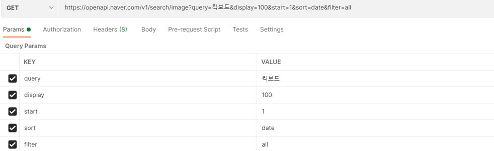
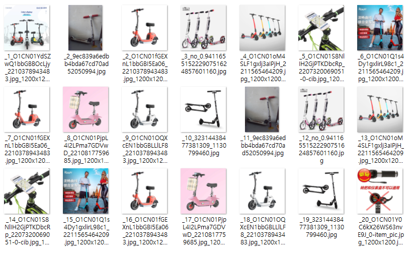

# Naver OpenApi Image 수집

> Naver Developers([링크](https://developers.naver.com/docs/serviceapi/search/image/image.md#%EC%9D%B4%EB%AF%B8%EC%A7%80))를 참조해 openapi image 수집에 대해서 알아본다.


### API 정보

* 기본정보

  | method | 요청 URL                                      | 출력 포맷 |
  | ------ | --------------------------------------------- | --------- |
  | GET    | https://openapi.naver.com/v1/search/image.xml | XML       |
  | GET    | https://openapi.naver.com/v1/search/image     | JSON      |

  

* 요청변수

  | 요청 변수 | 타입    | 필수 여부 | 기본값|
  | --------- | ------- | --------- | ------------------------------ |
  | query     | string  | Y    | -                              |
  | display   | integer | N    | 출력 건수 지정 : 10(기본갓), 100(최댓값)     |
  | start     | integer | N    | 1(기본값), 100(최댓값)                       |
  | sort      | string  | N    | 정렬 옵션 : sim(유사도순), date(날짜순)      |
  | filter    | string  | N    | 사이즈 필터 옵션 : all, large, medium, small |

* 호출 방법

  ```bash
  curl "https://openapi.naver.com/v1/search/image.xml?query=%EC%A3%BC%EC%8B%9D&display=10&start=1&sort=sim" \
      -H "X-Naver-Client-Id: {애플리케이션 등록 시 발급받은 client id 값}" \
      -H "X-Naver-Client-Secret: {애플리케이션 등록 시 발급받은 client secret 값}" -v
  ```

  * `X-Naver-Client-Id`, `X-Naver-Client-Secret` : 필수 입력


### Postman확인

* 주소 및 변수 입력

  

* Headers 입력

  

* 결과

  ```json
  {
      "lastBuildDate": "Mon, 28 Jun 2021 16:06:32 +0900",
      "total": 197304,
      "start": 1,
      "display": 100,
      "items": [
          {
              "title": "전동킥보드 emicro접이식 전동차 소형차 출근 킥보드 바퀴두개 미니 작은돌고래 배터리카 : 몰킹몰",
              "link": "http://shop1.phinf.naver.net/20210628_112/1624846429262qKjTk_JPEG/O1CN01YdSZwQ1bbGBBOcLjy_2210378943483.jpg_1200x1200.jpg",
              "thumbnail": "https://search.pstatic.net/common/?src=http://shop1.phinf.naver.net/20210628_112/1624846429262qKjTk_JPEG/O1CN01YdSZwQ1bbGBBOcLjy_2210378943483.jpg_1200x1200.jpg&type=b150",
              "sizeheight": "800",
              "sizewidth": "800"
          },
          {
              "title": "(엄빵)킥보드(중고) : 중고다팜",
              "link": "http://shop1.phinf.naver.net/20210628_91/1624845253746m5fDo_JPEG/9ec839a6edbb4bda67cd70ad52050994.jpg",
              "thumbnail": "https://search.pstatic.net/common/?src=http://shop1.phinf.naver.net/20210628_91/1624845253746m5fDo_JPEG/9ec839a6edbb4bda67cd70ad52050994.jpg&type=b150",
              "sizeheight": "600",
              "sizewidth": "450"
          },
          {
              "title": "HUDORA 독일 휴도라 킥보드 접이식 빅휠 스턴트스쿠터 : 와니비니상점",
              "link": "http://shop1.phinf.naver.net/20210628_117/1624857677719V0qMU_JPEG/no_0.94116551522290751624857601160.jpg",
              "thumbnail": "https://search.pstatic.net/common/?src=http://shop1.phinf.naver.net/20210628_117/1624857677719V0qMU_JPEG/no_0.94116551522290751624857601160.jpg&type=b150",
              "sizeheight": "800",
              "sizewidth": "800"
          }
          ... 생략
  ```

  


### python으로 이미지 수집

* 기본세팅

  ```python
  import requests
  import time
  import json
  
  # 요청변수
  keyword = '킥보드'
  display = 10
  sort = 'date'
  
  # image 저장장소
  image_path = 'images/'
  
  # .txt file 저장 파일 만들기
  project = 'naver_openapi_image'
  output_file_name = project + "_list_" + time.strftime("%y%m%d_%H%M%S") + '.txt'
  output_file = open(output_file_name, "w", encoding="utf-8")
  output_file.write('start\tnum\ttitle\tlink\tthumbnail\tsizeheight\tsizewidth')
  
  output_file.close()
  ```

* write 함수

  ```python
  def fwrite_news(start, num, title, link, thumbnail, sizeheight, sizewidth):
      print([start, num, title, link, thumbnail, sizeheight, sizewidth])
      output_file = open(output_file_name, 'a', encoding='utf-8')
      output_file.write(f'{start}\t{num}\t{title}\t{link}\t{thumbnail}\t{sizeheight}\t{sizewidth}\n')
      output_file.close()
  
  ```

  * `open` : `'w'` 모드하면 기존 column들이 지워지므로 `'a'`로 설정

* crawl 함수

  ```python
  def fcrawl_news(start):
      url = f'https://openapi.naver.com/v1/search/image?query={keyword}&display={display}&start={start}&sort={sort}'
  
      headers = {'User-Agent': 'Mozilla/5.0 (Windows NT 10.0; Win64; x64) AppleWebKit/537.36 (KHTML, like Gecko) Chrome/91.0.4472.101 Safari/537.36',
                 'X-Naver-Client-Id': '애플리케이션 등록 시 발급받은 client id 값',
                 'X-Naver-Client-Secret': '애플리케이션 등록 시 발급받은 client secret 값'}
      response = requests.get(url, headers=headers)
      elts = json.loads(response.text)['items']
  
      num = display * (start - 1) 
      for elt in elts:
          num += 1
          try:
              title = elt['title']
              link = elt['link']
              thumbnail = elt['thumbnail']
              sizeheight, sizewidth = elt['sizeheight'], elt['sizewidth']
              image_file_name = link.split('/')[-1]
  
              img = requests.get(link).content
              open(f'{image_path}_{num}_{image_file_name}', 'wb').write(img)
              time.sleep(1)
              fwrite_news(start, num, title, link, thumbnail, sizeheight, sizewidth)
          except:
              continue
      output_file.close()
  ```

  * `elts` 에 json형식으로 값을 받아온다.
  * `num = display * (start - 1)` : `display`가 10으로 세팅되어있고, start가 1, 2, 3으로 입력되므로 `num`이 serial로 쌓이게 된다.
  * `image_file_name `은 "http://shop1.phinf.naver.net/20210628_117/1624857677719V0qMU_JPEG/no_0.94116551522290751624857601160.jpg" 의 마지막 부분인 no_0.94116551522290751624857601160.jpg 와 같은 이름을 가져오게 된다.

  * `open(f'{image_path}_{num}_{image_file_name}', 'wb').write(img)` : 이미지 저장

* main 함수

  ```python
  def fmain():
      for start in range(1, 3): # start가 1~3까지만
          print(start)
          fcrawl_news(start)
          time.sleep(6)
  ```

* 실행

  ```python
  main()
  ```

  ```
  start	num	title	link	thumbnail	sizeheight	sizewidth1	1	전동킥보드 emicro접이식 전동차 소형차 출근 킥보드 바퀴두개 미니 작은돌고래 배터리카 : 몰킹몰	http://shop1.phinf.naver.net/20210628_112/1624846429262qKjTk_JPEG/O1CN01YdSZwQ1bbGBBOcLjy_2210378943483.jpg_1200x1200.jpg	https://search.pstatic.net/common/?src=http://shop1.phinf.naver.net/20210628_112/1624846429262qKjTk_JPEG/O1CN01YdSZwQ1bbGBBOcLjy_2210378943483.jpg_1200x1200.jpg&type=b150	800	800
  1	2	(엄빵)킥보드(중고) : 중고다팜	http://shop1.phinf.naver.net/20210628_91/1624845253746m5fDo_JPEG/9ec839a6edbb4bda67cd70ad52050994.jpg	https://search.pstatic.net/common/?src=http://shop1.phinf.naver.net/20210628_91/1624845253746m5fDo_JPEG/9ec839a6edbb4bda67cd70ad52050994.jpg&type=b150	600	450
  1	3	HUDORA 독일 휴도라 킥보드 접이식 빅휠 스턴트스쿠터 : 와니비니상점	http://shop1.phinf.naver.net/20210628_117/1624857677719V0qMU_JPEG/no_0.94116551522290751624857601160.jpg	https://search.pstatic.net/common/?src=http://shop1.phinf.naver.net/20210628_117/1624857677719V0qMU_JPEG/no_0.94116551522290751624857601160.jpg&type=b150	800	800
  1	4	전동킥보드 KOON 차소형 미니 스쿠터 접이식 성인 이륜 남녀 출근 간편한휴대 킥보드 : 클래스나우	http://shop1.phinf.naver.net/20210628_65/1624846352168Nj6xP_JPEG/O1CN01oM4SLF1gxlj3aIPjH_2211565464209.jpg_1200x1200.jpg	https://search.pstatic.net/common/?src=http://shop1.phinf.naver.net/20210628_65/1624846352168Nj6xP_JPEG/O1CN01oM4SLF1gxlj3aIPjH_2211565464209.jpg_1200x1200.jpg&type=b150	1000	1000
  1	5	자전거휴대폰거치대 GUB G-85전동 킥보드 전동자전거 배터리카 오토바이 3륜차 : 원스구매대행	http://shop1.phinf.naver.net/20210628_262/1624831908369XrYOJ_JPEG/O1CN01S8NlIH2GjPTKDbcRp_2207320069051-0-cib.jpg_1200x1200.jpg	https://search.pstatic.net/common/?src=http://shop1.phinf.naver.net/20210628_262/1624831908369XrYOJ_JPEG/O1CN01S8NlIH2GjPTKDbcRp_2207320069051-0-cib.jpg_1200x1200.jpg&type=b150	1000	1000
  1	6	전동킥보드 KOON 차소형 미니 스쿠터 접이식 성인 이륜 남녀 출근 간편한휴대 킥보드 : 클래스나우	http://shop1.phinf.naver.net/20210628_232/1624846352173qpl0l_JPEG/O1CN01Q1s4Dy1gxlirL98c1_2211565464209.jpg_1200x1200.jpg	https://search.pstatic.net/common/?src=http://shop1.phinf.naver.net/20210628_232/1624846352173qpl0l_JPEG/O1CN01Q1s4Dy1gxlirL98c1_2211565464209.jpg_1200x1200.jpg&type=b150	800	800
  1	7	전동킥보드 emicro접이식 전동차 소형차 출근 킥보드 바퀴두개 미니 작은돌고래 배터리카 : 몰킹몰	http://shop1.phinf.naver.net/20210628_213/1624846429269ILrmN_JPEG/O1CN01fGEXnL1bbGBI5Ea06_2210378943483.jpg_1200x1200.jpg	https://search.pstatic.net/common/?src=http://shop1.phinf.naver.net/20210628_213/1624846429269ILrmN_JPEG/O1CN01fGEXnL1bbGBI5Ea06_2210378943483.jpg_1200x1200.jpg&type=b150	800	800
  1	8	전동킥보드 작은돌고래 배터리카 전동차 소형차 남녀 킥보드 경량 리튬건전지 접이식자전거 : 알리바바상점	http://shop1.phinf.naver.net/20210628_160/1624835673528tGng9_JPEG/O1CN01PjpL4I2LPma7GDVwD_2210817759685.jpg_1200x1200.jpg	https://search.pstatic.net/common/?src=http://shop1.phinf.naver.net/20210628_160/1624835673528tGng9_JPEG/O1CN01PjpL4I2LPma7GDVwD_2210817759685.jpg_1200x1200.jpg&type=b150	800	800
  1	9	전동킥보드 emicro접이식 전동차 소형차 출근 킥보드 바퀴두개 미니 작은돌고래 배터리카 : 몰킹몰	http://shop1.phinf.naver.net/20210628_270/1624846429148zUhBK_JPEG/O1CN01OQXcEN1bbGBLLlLF8_2210378943483.jpg_1200x1200.jpg	https://search.pstatic.net/common/?src=http://shop1.phinf.naver.net/20210628_270/1624846429148zUhBK_JPEG/O1CN01OQXcEN1bbGBLLlLF8_2210378943483.jpg_1200x1200.jpg&type=b150	800	800
  1	10	주니어 성인 led 접이식 두바퀴 킥보드 4세 퀵보드 : Saintmall	http://shop1.phinf.naver.net/20210628_258/1624849806360RlQT5_JPEG/32314438477381309_1130799460.jpg	https://search.pstatic.net/common/?src=http://shop1.phinf.naver.net/20210628_258/1624849806360RlQT5_JPEG/32314438477381309_1130799460.jpg&type=b150	1000	1000
  2	11	(엄빵)킥보드(중고) : 중고다팜	http://shop1.phinf.naver.net/20210628_91/1624845253746m5fDo_JPEG/9ec839a6edbb4bda67cd70ad52050994.jpg	https://search.pstatic.net/common/?src=http://shop1.phinf.naver.net/20210628_91/1624845253746m5fDo_JPEG/9ec839a6edbb4bda67cd70ad52050994.jpg&type=b150	600	450
  2	12	HUDORA 독일 휴도라 킥보드 접이식 빅휠 스턴트스쿠터 : 와니비니상점	http://shop1.phinf.naver.net/20210628_117/1624857677719V0qMU_JPEG/no_0.94116551522290751624857601160.jpg	https://search.pstatic.net/common/?src=http://shop1.phinf.naver.net/20210628_117/1624857677719V0qMU_JPEG/no_0.94116551522290751624857601160.jpg&type=b150	800	800
  2	13	전동킥보드 KOON 차소형 미니 스쿠터 접이식 성인 이륜 남녀 출근 간편한휴대 킥보드 : 클래스나우	http://shop1.phinf.naver.net/20210628_65/1624846352168Nj6xP_JPEG/O1CN01oM4SLF1gxlj3aIPjH_2211565464209.jpg_1200x1200.jpg	https://search.pstatic.net/common/?src=http://shop1.phinf.naver.net/20210628_65/1624846352168Nj6xP_JPEG/O1CN01oM4SLF1gxlj3aIPjH_2211565464209.jpg_1200x1200.jpg&type=b150	1000	1000
  2	14	자전거휴대폰거치대 GUB G-85전동 킥보드 전동자전거 배터리카 오토바이 3륜차 : 원스구매대행	http://shop1.phinf.naver.net/20210628_262/1624831908369XrYOJ_JPEG/O1CN01S8NlIH2GjPTKDbcRp_2207320069051-0-cib.jpg_1200x1200.jpg	https://search.pstatic.net/common/?src=http://shop1.phinf.naver.net/20210628_262/1624831908369XrYOJ_JPEG/O1CN01S8NlIH2GjPTKDbcRp_2207320069051-0-cib.jpg_1200x1200.jpg&type=b150	1000	1000
  2	15	전동킥보드 KOON 차소형 미니 스쿠터 접이식 성인 이륜 남녀 출근 간편한휴대 킥보드 : 클래스나우	http://shop1.phinf.naver.net/20210628_232/1624846352173qpl0l_JPEG/O1CN01Q1s4Dy1gxlirL98c1_2211565464209.jpg_1200x1200.jpg	https://search.pstatic.net/common/?src=http://shop1.phinf.naver.net/20210628_232/1624846352173qpl0l_JPEG/O1CN01Q1s4Dy1gxlirL98c1_2211565464209.jpg_1200x1200.jpg&type=b150	800	800
  2	16	전동킥보드 emicro접이식 전동차 소형차 출근 킥보드 바퀴두개 미니 작은돌고래 배터리카 : 몰킹몰	http://shop1.phinf.naver.net/20210628_213/1624846429269ILrmN_JPEG/O1CN01fGEXnL1bbGBI5Ea06_2210378943483.jpg_1200x1200.jpg	https://search.pstatic.net/common/?src=http://shop1.phinf.naver.net/20210628_213/1624846429269ILrmN_JPEG/O1CN01fGEXnL1bbGBI5Ea06_2210378943483.jpg_1200x1200.jpg&type=b150	800	800
  2	17	전동킥보드 작은돌고래 배터리카 전동차 소형차 남녀 킥보드 경량 리튬건전지 접이식자전거 : 알리바바상점	http://shop1.phinf.naver.net/20210628_160/1624835673528tGng9_JPEG/O1CN01PjpL4I2LPma7GDVwD_2210817759685.jpg_1200x1200.jpg	https://search.pstatic.net/common/?src=http://shop1.phinf.naver.net/20210628_160/1624835673528tGng9_JPEG/O1CN01PjpL4I2LPma7GDVwD_2210817759685.jpg_1200x1200.jpg&type=b150	800	800
  2	18	전동킥보드 emicro접이식 전동차 소형차 출근 킥보드 바퀴두개 미니 작은돌고래 배터리카 : 몰킹몰	http://shop1.phinf.naver.net/20210628_270/1624846429148zUhBK_JPEG/O1CN01OQXcEN1bbGBLLlLF8_2210378943483.jpg_1200x1200.jpg	https://search.pstatic.net/common/?src=http://shop1.phinf.naver.net/20210628_270/1624846429148zUhBK_JPEG/O1CN01OQXcEN1bbGBLLlLF8_2210378943483.jpg_1200x1200.jpg&type=b150	800	800
  2	19	주니어 성인 led 접이식 두바퀴 킥보드 4세 퀵보드 : Saintmall	http://shop1.phinf.naver.net/20210628_258/1624849806360RlQT5_JPEG/32314438477381309_1130799460.jpg	https://search.pstatic.net/common/?src=http://shop1.phinf.naver.net/20210628_258/1624849806360RlQT5_JPEG/32314438477381309_1130799460.jpg&type=b150	1000	1000
  2	20	스케이트보드용품 부품 손잡이 SEALUP접이식전동차 킥보드 전환 9개 속도조절 기계 : 호두네상점	http://shop1.phinf.naver.net/20210628_80/1624820826446TOB6R_JPEG/O1CN01Y0C6kX26WS63nvE9J_0-item_pic.jpg_1200x1200.jpg	https://search.pstatic.net/common/?src=http://shop1.phinf.naver.net/20210628_80/1624820826446TOB6R_JPEG/O1CN01Y0C6kX26WS63nvE9J_0-item_pic.jpg_1200x1200.jpg&type=b150	800	800
  ```

  

