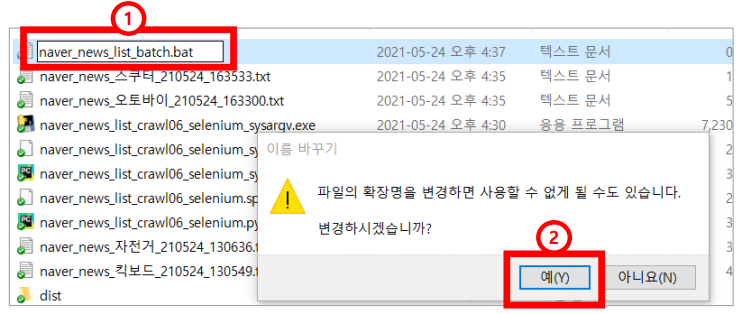
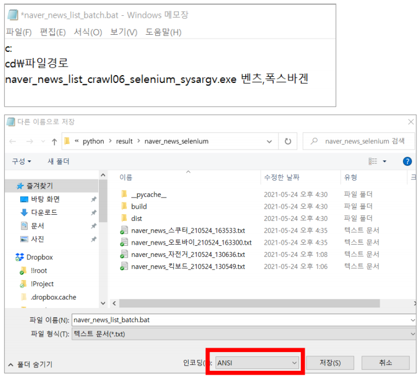
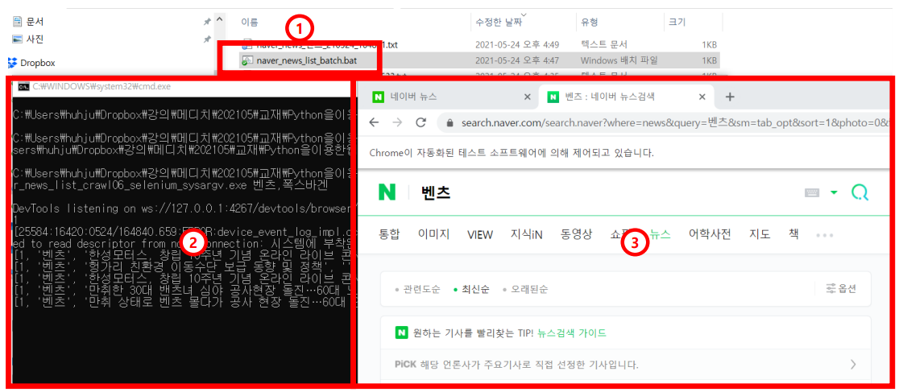

# Pyinstaller로 윈도우 실행파일 생성
> 파이썬이 설치되지 않은 환경에서도 파이썬 동작을 위한 컴파일하는 방법에 대해 알아본다.


### 설치

```bash
(cmd) pip install pyinstaller
```


### 파이썬 코드 추가

```python
import sys
if len(sys.argv) == 2:
    keywords = list(sys.argv[1].split(','))
else:
    keywords = ['킥보드', '자전거']
```

* 추가 변수를 입력시 추가변수로, 아닐시 디폴트 값('킥보드', '자전거') 키워드로 검색된다.


### 실행

```bash
(cmd) pyinstaler --onefile naver_news_list_crawl06_selenium.py
```

* 입력시 `.exe` 파일이 생성된다.

```bash
(cmd) naver_news_list_crawl06_selenium.exe 삼성, 애플
```

* `삼성,애플`에서 띄어 쓰기를 하면 두개의 변수로 인식한다. 여기서는 하나의 변수로 인식되게 만든다.


### .bat 파일로 자동화

: cmd 창을 열어 실행하는것은 번거로울 수 있다. 이 작업을 batch파일을 만들어서 실행한다.

* .txt 파일을 .bat 파일로 만들기

  

* 작성 및 저장

  

  

* .bat 파일 실행

  

