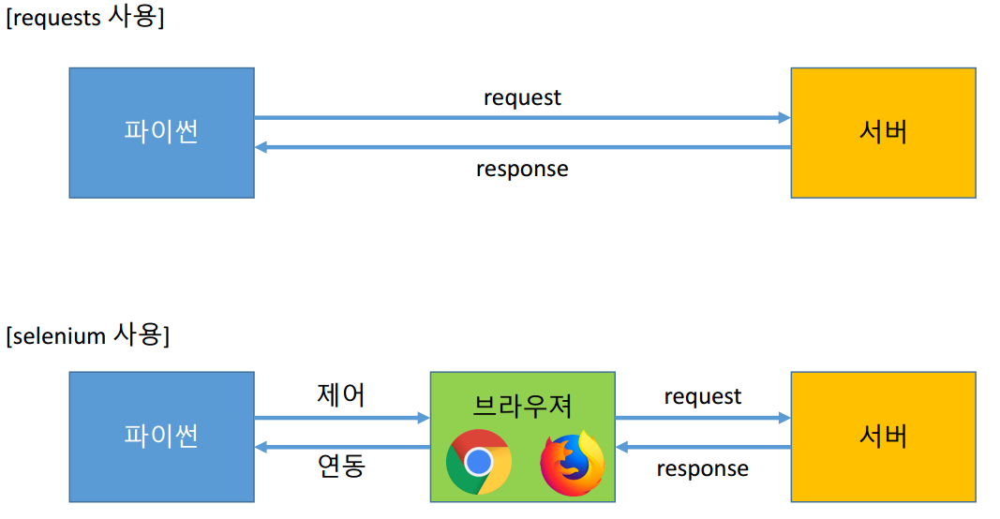
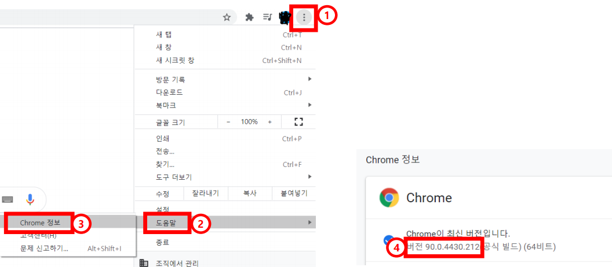
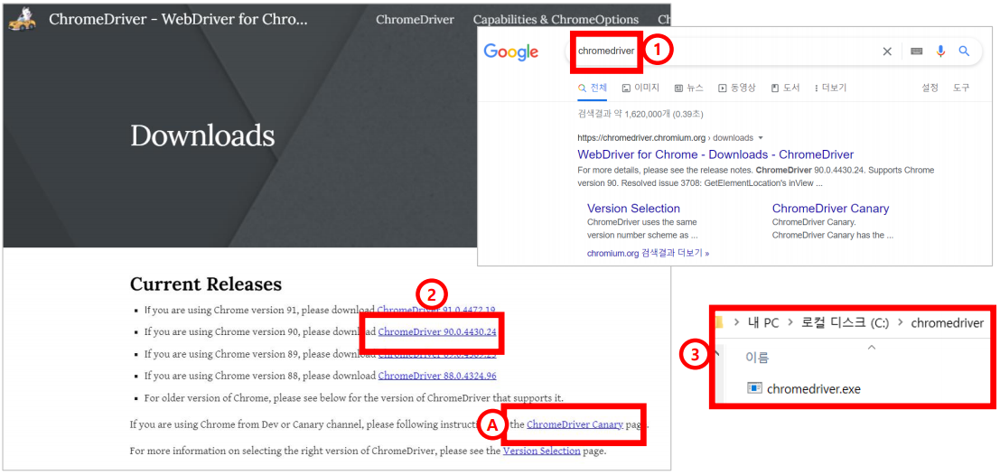

# Selenium(1)

> 다양한 웹페이지 형태, 비동기 통신을 사용하는 페이지를 수집할하는 방법 중 하나에 대해서 알아본다.

### 특징

* Selenium은 웹 브라우저의 자동화 기능을 지원하고 다양한 도구와 라이브러리를 포함한다.

* requests의 경우 python과 서버 사이에 request, response를 주고 받지만 Selenium의 경우 중간에 브라우져가 참여하게 된다.

  

* 비동기 방식을 사용하는 서버, 수집 난이도가 높은 서버에 적합하다.
* 로그인 처리 등 자동화 처리가 편리하다.
* 스크린샷 기능 등 부가 기능이 우수하다.
  * requests의 경우 빠른 속도, API 연결시 간편 등의 특징이 있다.

### 환경 세팅

* 확인사항

  크롬 브라우져 시행 → 오른쪽 위 → 도움말 → chrome 정보 → 버전 확인

  

* chromedriver 설치

  구글에 chromedriver 검색 → 버전에 맞는 파일 다운로드 → C:\chromedriver에 압축해제

  

  