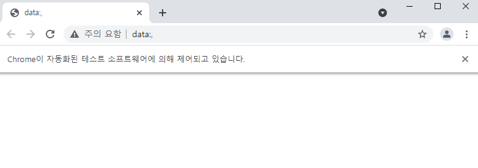
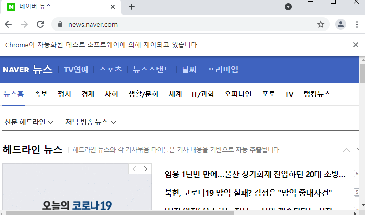
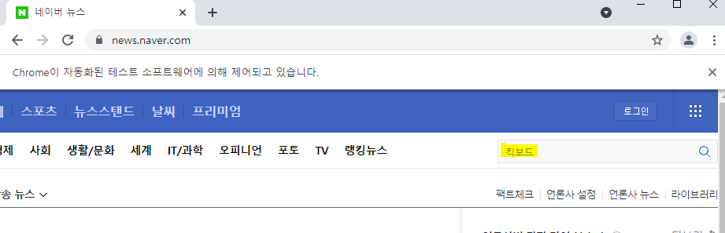
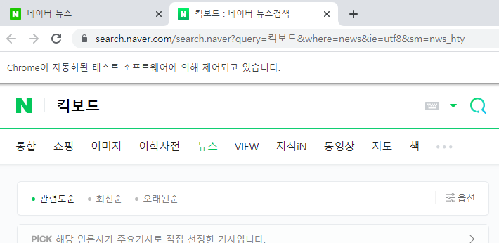

# Selenium(2)

> Selenium으로 직접 크롤링하는 python 코드에 대해 알아본다. (네이버 뉴스 예제 활용)


## 전반적인 코드 설명

* library 로드 및 driver 실행해보기

  ```python
  import time
  import selenium.webdriver as webdriver
  
  driver = webdriver.Chrome("C://chromedriver/chromedriver.exe")
  ```

  

  

* 탭 핸들

  ```python
  print(driver.window_handles)
  # ['CDwindow-000959196DD18CE24D8EA9FC709A951F']
  ```

  * 탭 목록들을 보여준다. 위에서 보이는 `data;,` 탭이 들어있다.


* 탭 선택

  ```python
  driver.switch_to.window(driver.window_handles[0])
  ```

  * 크롬창의 1번째 탭을 선택한다.(기본탭이 1개 이지만, 추후 새 탭이 발생할 수 있다.)


* 크롬창 이동 및 대기

  ```python
  driver.get(url_start)
  driver.implicitly_wait(10)
  ```

  * url_start로 이동하면서 구성요소를 전부 로딩할 때까지 10초 대기한다. (완료시 대기하지 않음)

  


* 검색창에 작성

  ```python
  driver.find_element_by_xpath("//input[@class='text_index']").send_keys(keyword)
  drvier.implicitly_wait(10)
  ```

  * keyword를 class가 `'text_index'`인 `input` 태그에 keyword를 작성해준다.

  


* 선택 영역 클릭

  ```python
  driver.find_element_by_xpath("//button[@type='submit']").click()
  driver.implicitly_wait(10)
  ```

  


* 탭 이동

  ```python
  driver.switch_to.window(driver.window_handles[1])
  driver.implicitly_wait(10)
  ```


* 검색 옵션 선택

  ```python
  driver.find_elements_by_xpath("/a[@role='option']")[1].click()
  driver.implicitly_wait(10)
  ```

  * `a[@role='option']`을 만족하는 것은 **관련도순**, **최신순**, **오래된순**인데, 이중에 두 번째에 있는 **최신순**을 클릭한다.


* 현재 driver가 수집한 html 소스 전체를 확인

  ```python
  print(driver.page_source)
  ```

  

* 기사 제목 가져오기

  ```python
  bodies = driver.find_elements_by_xpath("//ul[@class='list_news']/li")
  for body in bodies:
      news_title_elt = body.find_element_by_xpath(".//div[@class='news_area']/a")
      news_title = news_title_elt.get_attribute('title')
      time.sleep(3)
      print(news_title)
  ```

  ```
  유성구, 전동킥보드 거치대 설치
  용인시, 전동킥보드 불법주차 카카오톡으로 신고하세요
  [6/30(수) 데일리안 퇴근길 뉴스]가라앉지 않는 '김외숙 책임론'…민정 아닌 인사수석 저격 왜?
  ... 생략
  ```

  * `requests`의 경우 xpath에 의해 원하는 데이터를 바로 가져올 수 있지만 `selenium`은 `get_attribute`를 사용해 데이터를 가져오는 것으로 구분되어 있다.

* 다음 페이지로 가기

  ```python
  page_nav = driver.find_element_by_xpath("//div[@class='sc_page_inner']")
  next_page = page_nav.find_element_by_link_text(str(2)).click()
  ```

  * `page_nav` : 페이지 네비게이터 전체를 가져온다.(하나씩이 아니라 하나의 통으로)
  * `next_page` : `find_element_by_link_text(str(2))` 는 text가 2라고 써진 요소를 가리키고 `click()`을 통해 다음 페이지로 넘어간다. 


## 코드 정리

* 파이썬 정리 코드

  ```python
  import time
  from selenium import webdriver
  
  driver = webdriver.Chrome('C://chromedriver/chromedriver.exe')
  url_start = 'https://news.naver.com'
  keywords = ['킥보드', '자전거']
  
  def finput_keyword(keyword):
      driver.switch_to.window(driver.window_handles[0])
      driver.get(url_start)
      driver.implicitly_wait(10)
  
      driver.find_element_by_xpath('//input[@class="text_index"]').send_keys(keyword)
      driver.implicitly_wait(10)
  
      driver.find_element_by_xpath('//button[@type="submit"]').click()
      driver.implicitly_wait(10)
  
      driver.switch_to.window(driver.window_handles[1])
      driver.implicitly_wait(10)
  
      driver.find_elements_by_xpath('//a[@role="option"]')[1].click()
      driver.implicitly_wait(10)
      return driver
  def fmake_file(keyword):
      output_file_name = 'naver_news_' + keyword + "_" + time.strftime("%y%m%d_%H%M%S") + '.txt'
      output_file = open(output_file_name, "w", encoding="utf-8")
      output_file.write("페이지\t키워드\t제목\turl\n")
      output_file.close()
      return output_file_name
  def fwrite_news(i, keyword, news_title_clean, news_url, output_file_name):
      print([i, keyword, news_title_clean, news_url])
      output_file = open(output_file_name, "a", encoding="utf-8")
      output_file.write(f"{i}\t{keyword}\t{news_title_clean}\t{news_url}\n" )
      output_file.close()
      return
  
  def fcrawl_news_selenium(driver, keyword, i, output_file_name):
      bodies = driver.find_elements_by_xpath('//ul[@class="list_news"]/li')
      for body in bodies:
          news_title_elm = body.find_elements_by_xpath('.//a[@class="news_tit"]')[0]
          news_title = news_title_elm.get_attribute('title')
          try:
              news_url_elm = body.find_elements_by_xpath('.//a[@class="info"]')[0]
              news_url = news_url_elm.get_attribute('href')
          except:
              news_url = ''
          news_title_clean = news_title.replace('\n', " ").replace('\t', " ").strip()
          fwrite_news(i, keyword, news_title_clean, news_url, output_file_name)
      page_nav = driver.find_element_by_xpath('//div[@class="sc_page_inner"]')
      next_page = page_nav.find_element_by_link_text(str(int(i) + 1))
      next_page.click()
      driver.implicitly_wait(10)
      return
  
  
  def fmain():
      for keyword in keywords:
          output_file_name = fmake_file(keyword)
          driver = finput_keyword(keyword)
          for i in range(1, 15):
              print(i)
              fcrawl_news_selenium(driver, keyword, i, output_file_name)
              time.sleep(6)
      driver.close()
  
  fmain()
  ```

  

