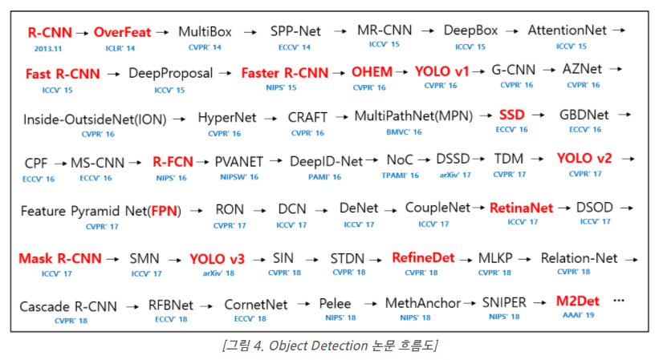
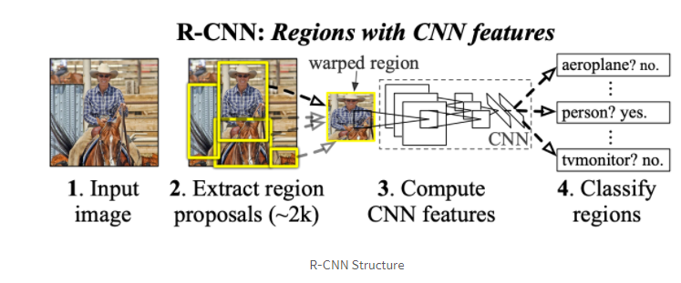
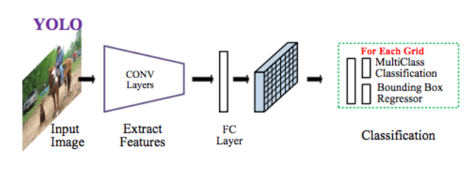
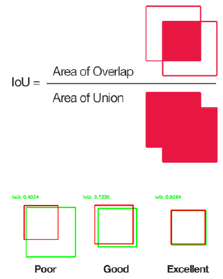

# [6강] 영상 인식 (image recognition) 이해

## 영상 인식(image recognition)

* 영상 내에서 대상을 탐지(detection) 한다.
* 그리고 그 대상을 분류(classification) 한다.

* 이를 영상 인식 (recognition)이라 한다.
* 하지만 그냥 object detection 이라고 말한다.

## 탐지(detection)와 분류(classfication)

* 보통 탐지(detection)된 결과는 박스로 표시한다.
* 위치를 나타낸다고 해서 localization 이라고도 부른다.
* 박스내의 영상을 분류(classification)한다.

## 영상 인식 현황

* 2개의 작업(탐지, 분류)이 동시에 필요하다.
* 따라서 속도가 느리거나 정확도가 떨어진다. (그렇게 떨어지지는 않는다.)
* 20개 정도의 소수 클래스를 사용한다.

## 요약

* 분류 : 영상 전체에 대한 분류
* 위치 탐지 : 영상내에서 대상의 위치 탐지

* 영상 인식 : 위치탐지와 대상의 분류

## 영상 인식 모델

* 크게 두 종류로 나뉜다.
* 영역을 먼저 찾고, 그 영역을 분류하는 모델들 : 정확도가 좋은 반면 속도가 상대적으로 느림
  *  RCNN, Fast RCNN, Faster RCNN, Mask RCNN
*  영역 찾기와 분류를 동시에 하는 모델들 : 속도가 빠른 반면 정확도가 상대적으로 떨어짐
  * YOLO,  SSD

* R-CNN 방법들 : 영역을 먼저 찾고, 해당 영역에 대하여 분류한다.

* YOLO, SSD의 방법 : 영역 찾기와 분류를 동시에

## 성능 지표

* IoU, mAP, AR이 많이 사용된다.

#### IoU 

* Intersection over Union : 정답과 탐지해낸 결과의 영역 일치 정도

#### mAP

* mean Average Precision : 여러개의 물체가 탐지된 경우 각 정밀도의 평균

#### Average Recall

* 탐지해야 할 물체 중 정확히 탐지한 개수의 비율의 평균

