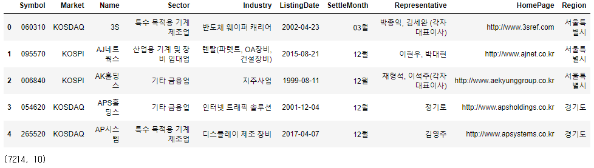
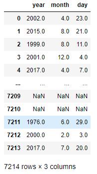
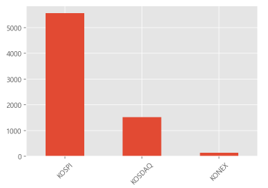
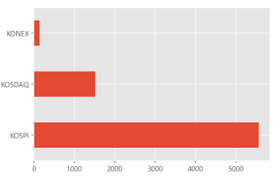
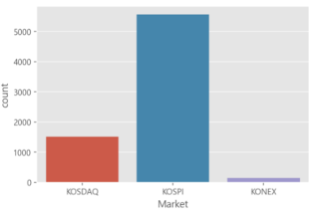

## KRX 전체 종목분석(1)

> 데이터 분석에 필요한 여러 도구들을 정리한다.


## 주어진데이터

```python
df = pd.read_csv('./data/krx.csv', dtype={'Symbol':object})
display(df.head())
df.shape
```




#### 중복 제외한 unique 값의 개수 가져오기

```python
df.nunique()
```

```bash
Symbol            7214
Market               3
Name              7214
Sector             158
Industry          2263
ListingDate       1798
SettleMonth          9
Representative    2319
HomePage          2236
Region              22
dtype: int64


#### datetime으로 만들어주기

- 주어진 컬럼 dtype : object

  ```python
  df['ListingDate']
```

  ```bash
  0       2002-04-23
  1       2015-08-21
  2       1999-08-11
  3       2001-12-04
  4       2017-04-07
             ...    
  7209           NaN
  7210           NaN
  7211    1976-06-29
  7212    2000-02-03
  7213    2017-07-20
  Name: ListingDate, Length: 7214, dtype: object
  ```

- datetime으로 변경

  ```python
  df['ListingDate'] = pd.to_datetime(df['ListingDate'])
  df['ListingDate']
  ```

  ```bash
  0      2002-04-23
  1      2015-08-21
  2      1999-08-11
  3      2001-12-04
  4      2017-04-07
            ...    
  7209          NaT
  7210          NaT
  7211   1976-06-29
  7212   2000-02-03
  7213   2017-07-20
  Name: ListingDate, Length: 7214, dtype: datetime64[ns]
  ```

  * dtype : datetime64[ns] 로 변경

- `datetime.dt .year`,`datetime.dt.month`, `datetime.dt.day`

  ```python
  tmp = np.array([df['ListingDate'].dt.year, df['ListingDate'].dt.month, df['ListingDate'].dt.day]).T
  pd.DataFrame(tmp, columns=['year', 'month', 'day'])
  ```

  

* dataframe의 dtypes

  ```python
  df.dtypes
  ```

  ```bash
  Symbol                    object
  Market                    object
  Name                      object
  Sector                    object
  Industry                  object
  ListingDate       datetime64[ns]
  SettleMonth               object
  Representative            object
  HomePage                  object
  Region                    object
  dtype: object
  ```


* 빈도수 개수

  ```python
  df['Market'].value_counts()
  ```

  ```bash
  KOSPI     5559
  KOSDAQ    1517
  KONEX      138
  Name: Market, dtype: int64
  ```

* 빈도수 시각화

  * 방법1 : `pandas`의 `value_counts()`와 `plot.bar` 또는 `plot.barh`  를 활용

    ```python
    df['Market'].value_counts().plot.bar(rot=45) # 글자 45도 기울여준다.
    plt.show()
    ```

    

    ```python
    df['Market'].value_counts().plot.barh() 
    plt.show()
    ```

    

  

  * 방법2 : `seaborn` 활용

    ```python
    import seaborn as sns
    sns.countplot(data=df, x='Market')
    plt.show()
    ```

    

    ```python
    sns.countplot(data=df, y='Market') # 가로로 그릴려면 y를 지정
    plt.show()
    ```

    

