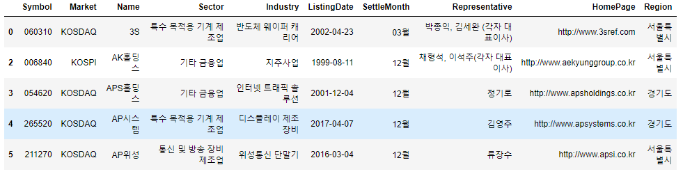
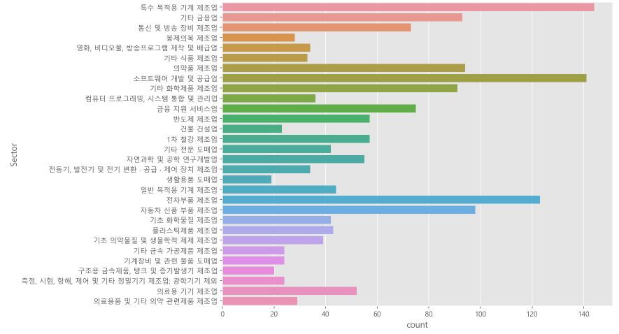
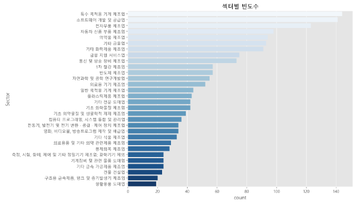
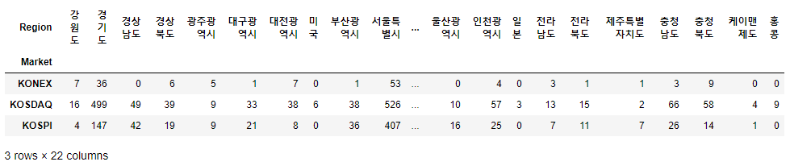

## KRX 전체 종목분석(2)

> 데이터 분석에 필요한 여러 도구들을 정리한다.


### Sector 빈도수 체크 : 상위 30개 체크

```python
sector_count_top = df['Sector'].value_counts().head(30)
sector_count_top
```

```bash
특수 목적용 기계 제조업                            144
소프트웨어 개발 및 공급업                           141
전자부품 제조업                                 123
자동차 신품 부품 제조업                             98
의약품 제조업                                   94
기타 금융업                                    93
기타 화학제품 제조업                               91
금융 지원 서비스업                                75
통신 및 방송 장비 제조업                            73
1차 철강 제조업                                 57
반도체 제조업                                   57
자연과학 및 공학 연구개발업                           55
의료용 기기 제조업                                52
일반 목적용 기계 제조업                             44
플라스틱제품 제조업                                43
기타 전문 도매업                                 42
기초 화학물질 제조업                               42
기초 의약물질 및 생물학적 제제 제조업                     39
컴퓨터 프로그래밍, 시스템 통합 및 관리업                   36
영화, 비디오물, 방송프로그램 제작 및 배급업                 34
전동기, 발전기 및 전기 변환 · 공급 · 제어 장치 제조업         34
기타 식품 제조업                                 33
의료용품 및 기타 의약 관련제품 제조업                     29
봉제의복 제조업                                  28
측정, 시험, 항해, 제어 및 기타 정밀기기 제조업; 광학기기 제외     24
기타 금속 가공제품 제조업                            24
기계장비 및 관련 물품 도매업                          24
건물 건설업                                    23
구조용 금속제품, 탱크 및 증기발생기 제조업                  20
생활용품 도매업                                  19
Name: Sector, dtype: int64
```


```python
sector_30 = df.loc[df['Sector'].isin(sector_count_top.index)]
sector_30.head()
```




### 그래프 표현

* seaborn countplot 기본 활용

  ```python
  import seaborn as sns
  sns.countplot(data=sector_30, y='Sector')
  plt.show()
  ```

  

* 크기 조절, 순서정렬, 색상변경, 제목

  ```python
  print(plt.colormaps())
  ```

  ```bash
  ['Accent', 'Accent_r', 'Blues', 'Blues_r', 'BrBG', 'BrBG_r', 'BuGn', 'BuGn_r', 'BuPu', 'BuPu_r', 'CMRmap', 'CMRmap_r', 'Dark2', 'Dark2_r', 'GnBu', 'GnBu_r', 'Greens', 'Greens_r', 'Greys', 'Greys_r', 'OrRd', 'OrRd_r', 'Oranges', 'Oranges_r', 'PRGn', 'PRGn_r', 'Paired', 'Paired_r', 'Pastel1', 'Pastel1_r', 'Pastel2', 'Pastel2_r', 'PiYG', 'PiYG_r', 'PuBu', 'PuBuGn', 'PuBuGn_r', 'PuBu_r', 'PuOr', 'PuOr_r', 'PuRd', 'PuRd_r', 'Purples', 'Purples_r', 'RdBu', 'RdBu_r', 'RdGy', 'RdGy_r', 'RdPu', 'RdPu_r', 'RdYlBu', 'RdYlBu_r', 'RdYlGn', 'RdYlGn_r', 'Reds', 'Reds_r', 'Set1', 'Set1_r', 'Set2', 'Set2_r', 'Set3', 'Set3_r', 'Spectral', 'Spectral_r', 'Wistia', 'Wistia_r', 'YlGn', 'YlGnBu', 'YlGnBu_r', 'YlGn_r', 'YlOrBr', 'YlOrBr_r', 'YlOrRd', 'YlOrRd_r', 'afmhot', 'afmhot_r', 'autumn', 'autumn_r', 'binary', 'binary_r', 'bone', 'bone_r', 'brg', 'brg_r', 'bwr', 'bwr_r', 'cividis', 'cividis_r', 'cool', 'cool_r', 'coolwarm', 'coolwarm_r', 'copper', 'copper_r', 'crest', 'crest_r', 'cubehelix', 'cubehelix_r', 'flag', 'flag_r', 'flare', 'flare_r', 'gist_earth', 'gist_earth_r', 'gist_gray', 'gist_gray_r', 'gist_heat', 'gist_heat_r', 'gist_ncar', 'gist_ncar_r', 'gist_rainbow', 'gist_rainbow_r', 'gist_stern', 'gist_stern_r', 'gist_yarg', 'gist_yarg_r', 'gnuplot', 'gnuplot2', 'gnuplot2_r', 'gnuplot_r', 'gray', 'gray_r', 'hot', 'hot_r', 'hsv', 'hsv_r', 'icefire', 'icefire_r', 'inferno', 'inferno_r', 'jet', 'jet_r', 'magma', 'magma_r', 'mako', 'mako_r', 'nipy_spectral', 'nipy_spectral_r', 'ocean', 'ocean_r', 'pink', 'pink_r', 'plasma', 'plasma_r', 'prism', 'prism_r', 'rainbow', 'rainbow_r', 'rocket', 'rocket_r', 'seismic', 'seismic_r', 'spring', 'spring_r', 'summer', 'summer_r', 'tab10', 'tab10_r', 'tab20', 'tab20_r', 'tab20b', 'tab20b_r', 'tab20c', 'tab20c_r', 'terrain', 'terrain_r', 'turbo', 'turbo_r', 'twilight', 'twilight_r', 'twilight_shifted', 'twilight_shifted_r', 'viridis', 'viridis_r', 'vlag', 'vlag_r', 'winter', 'winter_r']
  ```

  ```python
  plt.figure(figsize=(10, 8))
  sns.countplot(data=sector_30, y='Sector', 
                order=sector_count_top.index, pallete='Blues').set_title('섹터별 빈도수')
  plt.show()
  ```

  

### 두 개의 변수 빈도수 구하고 시각화 하기

* `pd.crosstab`을 활용해  2개 변수에 대한 빈도수 구하기

  ```python
  pd.crosstab(df['Market'], df['Region'])
  ```

  

