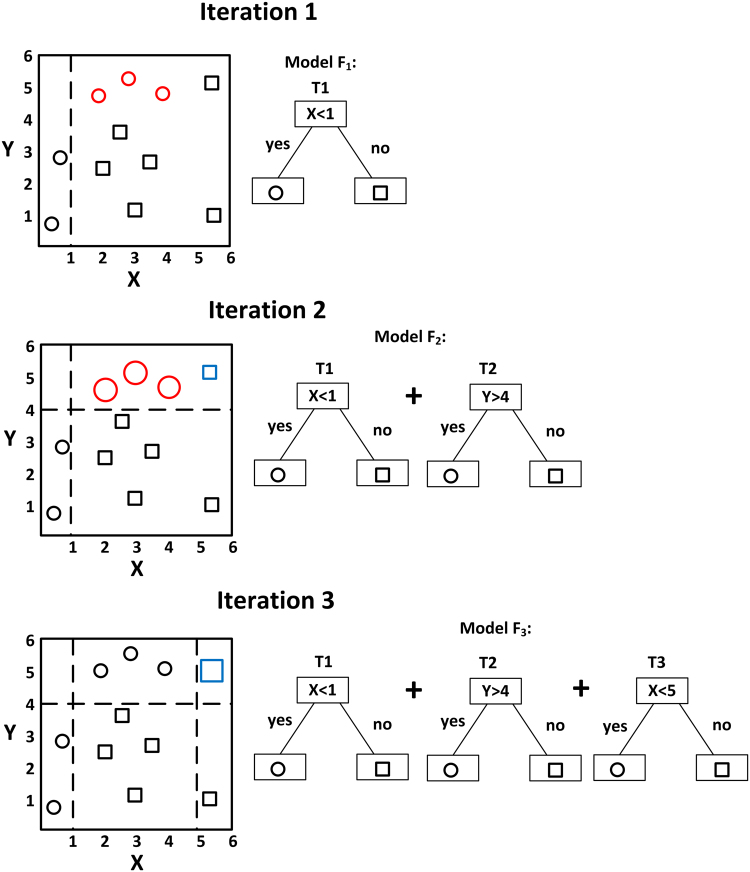

# 부스팅(Boosting)

> 앙상블 알고리즘의 하나로 반복적으로 모델을 업그레이드해나간다. 이때 이전 iteration의 결과에 따라 데이터셋 sample에 대한 가중치를 부여한다. 결과적으로, 반복할 때마다 각 sample의 중요도에 따라 새로운 classifier가 만들어진다. 결과적으로, 모든 iteration에서 생성된 모델의 결과로 voting하게 된다.

## 대략적인 설명

##### [이미지 출처](https://pubmed.ncbi.nlm.nih.gov/30006563/)

**(Iteration1)** 첫 분류에서 빨간 원은 잘못 분류된 sample이다. 따라서 잘못 분류된 sample(빨간 원)에 대해 높은 가중치를  부여해 새로운 분류기를 만든다.

**(Iteration2)** Iteration1에서 만들어진 분류기에 새로운 분류기를 추가해 새롭게 분류한다.  이때 파란색 사각형은 잘못 분류된 sample이다. 이 sample(파란 사각형)에 대해 가중치를 높여 새로운 분류기를 다시 만든다.

**(Iteration3)** iteration2에서 사용된 2개의 분류기에 새로운 분류기를 추가해 최종적으로 분류한다.

## 알고리즘 종류

### (1) 에이다부스트(AdaBoost : Adaptive Boosting)

(메모)

* stump tree 사용 : weak model

* epsilon_t : 정답을 못맞춘 확률
* e_t >= 0.5이면 멈추는 이유 : 랜덤하게 뽑는것 보다 확률이 낮다면 가망이 없는 모델..
* e_t = 0.5 일때 alpha_t = 0
* e_t = 0 (모두 맞춤) 이며 1/2ln(1/0) -> inf 
