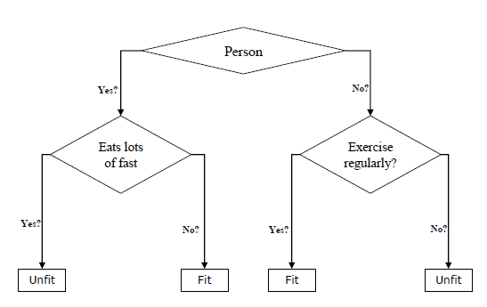
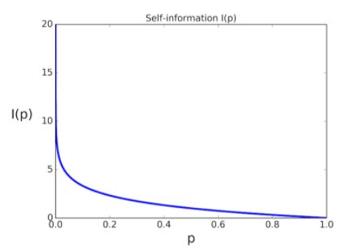
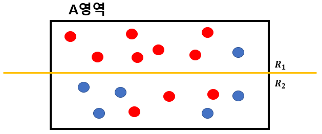

# Decision Tree(이론)

> Decision Tree(결정 트리)는 분류와 회귀 모두 가능한 ML 모델 중 하나이다.  

## Decision Tree란?

> 데이터를 분석해서 이들 데이터 사이에 존재하는 패턴을 찾고 예측 가능한 규칙들의 조합을 만드는 알고리즘이다. 주로 변수들이 이산적인 데이터일때 classification 작업을 위해 많이 사용된다.

* 특징
  *  최종모양이 나무를 거꾸로 뒤집은 모양이다.
  * 제일 위에 있는 node를 root node라고 일컫는다. **( Ex. Person )**
  * 말단 node들을 terminal node 또는leaf node라고 말한다. **( Ex. Unit, Fit )**
  * 중간 단계에 있는 node들은 intermediate node라고 한다. **( Ex. Eats lots of fast, Exercise regularly? )**

* 장점

  - 빠르게 학습 가능하고 비교적 간단한 형태이다.

  - 다른 모델에 비해 더 좋은 성능을 낼 때가 있다.

  * 실생활에서 사용하는 분류방식이므로 직관적이다.

* 단점 

  * 연속 변수에 취약하다.
  * 분류의 개수가 많을 때 tree가 너무 커지게 된다.
  * overfitting(과대적합)에 대한 문제가 발생한다.

* 학습 방법

  * 순도(Purity)가 증가하는 방향으로 불순도(Impurity)/불확실성(Entropy)가 감소하는 방향으로 영역을 나눠 Tree가 분기되며 학습이 진행된다.

  * 이때 정보이론(Information Theroy)에서 순도가 증가하고 불순도 및 불확실성이 감소하는것을 Information Gain(정보획득)이라 일컫는다.

  * 이 정보획득의 양이 크게 발생하는 방향으로 독립변수 또는 node가 선택된다.

  * 더 자세한 내용은 아래에서 진행한다.

* 정보 함수 

    : 정보의 양,가치를 나타내는 정보함수는 다음과 같이 정의 된다.  

    

    

  * 그래프를 살펴보면 항상 일어나는 사건(확률=1)인 경우 정보의 양은 0이고

    확률이 0에 가까울 수록 정보의 가치가 많고 양이 많다고 말한다.

* 엔트로피(Entropy)

     : 무질서도를 정량화해서 수치적으로 표현 또는 확률변수의 불확실성을 수치로 표현한다.

     * 엔트로피가 높을수록 불확실성이 높고 특징을 찾아내기 어렵다.

     * 상태 전이 : 여기서는 불확실한 상황 → 불확실 하지 않은 상황 으로의 변이를 뜻한다.
       * 불확실한 상황(정보량이 많음 → Entropy가 높음)
       * 확실한 상황(정보량이 적다→ Entropy가 낮음)

     * 정의 :

       여기서 는 ***A***영역에 속하는 데이터의 비율을 나타낸다.

       * **예제**

     ​                  

     ​                   
     
     * 두 개 이상의 영역에 대한 Entropy 정의 : 
     
       여기서는 분할 전 데이터 와 분할 후 i영역에 속하는 데이터의 비율이다.
            
     
        * **예제**
     

     

**결과적으로** 0.9544 →0.7489 로 Entropy 가 분기 후 감소했다. 즉, 불확실성 감소, 순도 증가, 0.9544-0.7489 만큼의 정보 획득량이 발생했다.

이 분기가 최적 인지는 알지 못하지만

#### ***Decision Tree는 정보획득량이 최대로 증가하도록 분기를 증가한다!!!!!!!!!!!!!!!!!!!!!!!!!!!!!***

