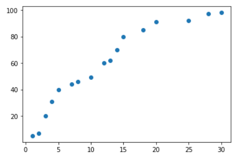

# Linear Regression(수업방식)

> 간단한 예제를 통해 Linear Regression 을 알아본다.


## 1. Training Data Set

> ML에 입력으로 사용될 데이터를 `Numpy`의  `ndarray` 형태로 준비한다.

```python
import numpy as np
import matplotlib.pyplot as plt

x_data = np.array([1,2,3,4,5,7,8,10,12,13,14,15,18,20,25,28,30]).reshape(-1,1)
t_data = np.array([5,7,20,31,40,44,46,49,60,62,70,80,85,91,92,97,98]).reshape(-1,1)

plt.scatter(x_data.ravel(),t_data.ravel())
plt.show()
```




## 2. Linear Regression model 정의

> **y = Wx + b** 와 같이 Linear regression model( **Hypothesis** )을 정의한다. 여기서 **W**는 weight이고 **b**는 bias를 의미한다. 이 예제에서는 랜덤값을 사용한다. 

```python
W = np.random.rand(1,1)
b = np.random.rand(1)
# 주의해야 할 점은 W와 같은 경우 Multiple Linear Regression 고려해 nx1 꼴로 만들어주는게 효율적이다.

H = np.dot(x_data, W)+b
```


## 3. loss function 정의

> loss function(손실함수)는 cost function 이라고도 불린다.

```python

```

