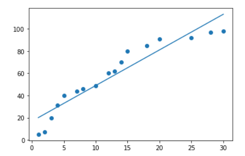
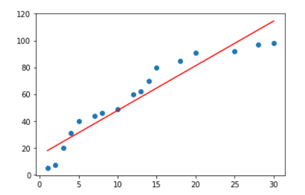

# Linear Regression(내방식)

> loss function과 수치미분과의 연관성이 조금 없어보이기 때문에 새로운 방식으로 코드를 작성한다.


## 1. Training data

```python
x_data = np.array([1,2,3,4,5,7,8,10,12,13,14,15,18,20,25,28,30]).reshape(-1,1)
t_data = np.array([5,7,20,31,40,44,46,49,60,62,70,80,85,91,92,97,98]).reshape(-1,1)

```



## 2. weight, bias정의

```python
var = np.random.rand(2,1)
```


## 3. loss function 정의

```python
def loss_func(var) :
    
    # 준비된 데이터
    global x_data
    global t_data
    
    # Hypothesis
    A = np.concatenate([x_data, np.ones_like(x_data)],axis=1)
    H = np.dot(A, var)

    return np.mean(np.power(H-t_data,2))
```


## 4. Gradient Descent method

```python
learning_rate = 1e-4
for step in range(30000):
    
    var = var - learning_rate * numerical_derivative(loss_func,var)
     
    if step % 3000 == 0 :
        print('W : {}, b : {}, loss : {}'.format(var[0],var[1],loss_func(var)))
```

```bash
# 결과
W : [0.57202216], b : [0.5125748], loss : 3099.6978768340264
W : [3.92030545], b : [3.56507319], loss : 146.03447484230364
W : [3.79450604], b : [5.92277162], loss : 127.39427212583274
W : [3.69100654], b : [7.86253121], loss : 114.77687020961031
W : [3.60585394], b : [9.45843815], loss : 106.23625326811995
W : [3.53579597], b : [10.77144567], loss : 100.4551789847266
W : [3.47815687], b : [11.85170212], loss : 96.54201672734192
W : [3.43073519], b : [12.74046625], loss : 93.89322895850582
W : [3.39171975], b : [13.47168307], loss : 92.10028601802222
W : [3.35962041], b : [14.0732803], loss : 90.88665749494503
```


## 5. predict

```python
def predict(x):
    global var
    return var[0]*x + var[1]

print(predict(19))
# [77.89924936]
```


## 6. 그래프로 확인

```python
plt.scatter(x_data.ravel(), t_data.ravel())
plt.plot(x_data.ravel(),x_data.ravel()*var[0]+var[1],'r')
plt.show()
```




