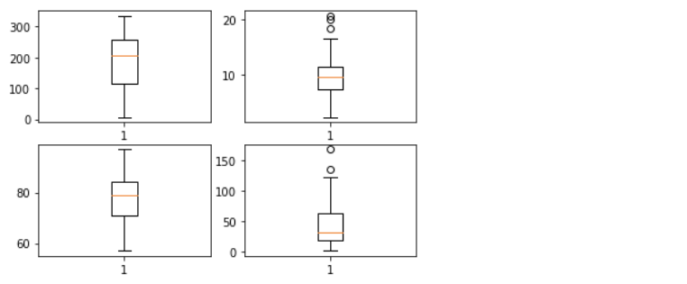
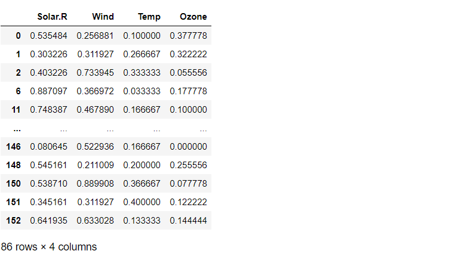

# Multiple Linear Regression(1)-Preprocessing

> **온도**, **태양광**, **바람**에 따른 **오존량**을 Multiple Linear regression model을 통해 추측하는 model을 만들어 본다. 단원은 다음과 같은 순서로 진행된다. 
>
> **1. Preprocessing**
>
> **2. numpy,&pandas**
>
> **3. scipy**  
>
> **4. tensorflow** 


## 사용될 package 및 library 불러오기

> 코드에서 사용될 package 및 library를 불러온다.

```python
import numpy as np                              
import pandas as pd
import matplotlib.pyplot as plt
from sklearn import linear_model
from scipy import stats
from sklearn.preprocessing import MinMaxScaler 
import tensorflow as tf
```


## DataSet 살펴보기

> 어떤 DataSet을 다루는지 간단히 알아본다.

```python
df = pd.read_csv('./data/ozone.csv')
display(df.head())
```


```python
training_data = df.copy().loc[:,['Solar.R', 'Wind', 'Temp', 'Ozone']]
print(training_data.shape)  # (153, 4)
display(training_data.head())
```


## Preprocessing

> 결측치 제거, 이상치 제거, Normalization 순서로 진행된다.


#### 결측치 제거

> 결측치를 평균값으로 변경하거나 삭제등 몇가지 방법이 존재하지만 삭제하는 방법을 진행한다.

```python
training_data = training_data.dropna(how='any') # how='any' 는 default이다.
print(training_data.shape)                      # (111, 4)
display(training_data.head())
```

  

#### 이상치 제거

> 한 column에 대하여 이상치를 제거할 때마다 다른 column에 영향을 주지만 이 문제에서는 큰 영향을 주지 않기 때문에 한 column씩 지워나가는 방법을 선택했다. 이상치 제거 방법으로는 **Z-Score**를 이용했다. 

```python
#-------- 그래프----------
fig = plt.figure()
g1 = fig.add_subplot(2,2,1)
plt.boxplot(training_data.iloc[:,0])
g2 = fig.add_subplot(2,2,2)
plt.boxplot(training_data.iloc[:,1])
g3 = fig.add_subplot(2,2,3)
plt.boxplot(training_data.iloc[:,2])
g4 = fig.add_subplot(2,2,4)
plt.boxplot(training_data.iloc[:,3])
plt.show()
```

 

```python
zscore_threshold = 1.8
for col in training_data.columns:
    training_data = training_data[(~(np.abs(stats.zscore(training_data[col])) > zscore_threshold))]
 
#-------- 그래프----------
fig = plt.figure()
g1 = fig.add_subplot(2,2,1)
plt.boxplot(training_data.iloc[:,0])
g2 = fig.add_subplot(2,2,2)
plt.boxplot(training_data.iloc[:,1])
g3 = fig.add_subplot(2,2,3)
plt.boxplot(training_data.iloc[:,2])
g4 = fig.add_subplot(2,2,4)
plt.boxplot(training_data.iloc[:,3])
plt.show()    
```


#### 정규화 과정

> 0과 1사이의 값이 되도록 **Min-Max Normalization**을 이용한다. `sklearn.preprocessing` 에 있는 `MinMaxScaler` 를 사옹한다.

```python
scaler_x = MinMaxScaler() # 각 column 마다 할 필요 없이 한번에 진행할 수 있다.
scaler_t = MinMaxScaler()

scaler_x.fit(training_data.iloc[:, :-1])
scaler_t.fit(training_data.iloc[:, -1].values.reshape(-1,1))

training_data.iloc[:, :-1] = scaler_x.transform(training_data.iloc[:, :-1])
training_data.iloc[:, -1]  = scaler_t.transform(training_data.iloc[:, 3].values.reshape(-1,1))

display(trainig_data)
```

