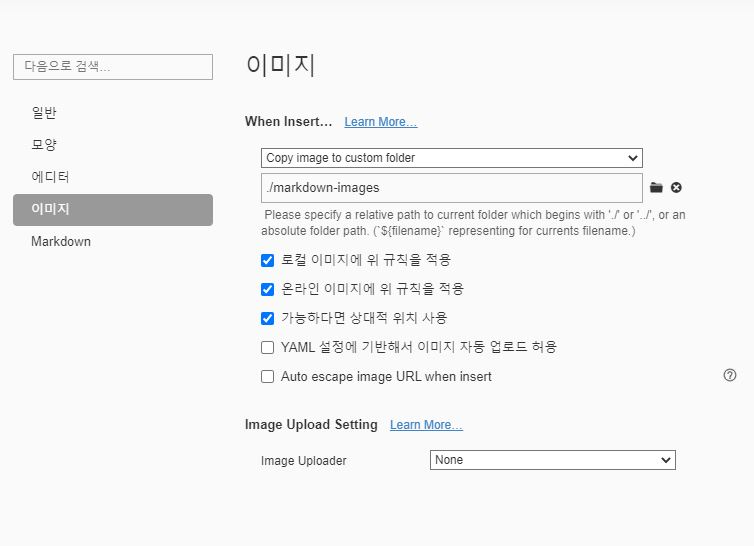

# 마크다운 문법

## 제목(heading)

제목은 `#` 로 표현가능하다.`H1`~`H6`까지 표현 가능하다.

### 제목3

#### 제목4

##### 제목5

###### 제목6 

##  목록 (`*`)

* 목록은 
* 순서가 없는 목록이 
* 있다.
  * 탭을 통해 목록 수준을 표현할 수 있다.
  * 엔터로 다시 탭 전으로 돌아감
* 엔터

1. 순서가 있는 목록도

2. 있다.

   1. 엔터를 누르고 *을 하면

   * 섞어서 쓸수도 있다.

## 코드 블록

```python
print('hello!')
# 이것은 주석입니다.
```


```html
<!-- 주석 -->
# 주석 아님
<h1>
    안녕
</h1>
```

## 링크

외부 URL : [google](http://google.com)

특정 파일의 상대 경로 : [README](./README.md)


## 이미지 파일

* 

* 위와 같이 절대경로로 표현하면, Github 등에서 파일이 존재하지 않아 이미지가 제대로 출력되지 않는다.
* 따라서 typora에 다음과 같은 설정을 해보자.
* 
* 표 작성

| 이름   | 나이 | 비고 |
| ------ | ---- | ---- |
| 홍길동 | 300  |      |
| 김철수 | 10   |      |
|        |      |      |

## 기타 문법

* *기울임 이탤릭체* 

* **굵게 볼드체**

* ~~취소선~~ 

* `인라인코드블록`

---

