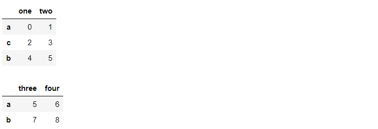

# Concatenation

> `Series`를 1차원, 2차원으로 연결하는 방법 또는 `DataFrame`들에 대한 연결 하는 방법에 대해서 알아본다.
>
> (`merge` 와는 다르다.)
>
> `concat`이라는 keyword를 사용하고 `axis`(행방향, 열방향), `sort`(index를 정렬)등의 option을 줄 수 있다. 또한 연결 할 `Series`는 python의 `list` 형태로 대입한다.


## 1. Series의 1차원 연결

> `axis=0` 값으로 `Series`들을 연결한다. 1차원 연결의 경우 `sort` 옵션을 적용해도 적용되지 않는다.

```python
import numpy as np
import pandas as pd

s1 = pd.Series([0, 1], index=['a', 'c']) 
s2 = pd.Series([4, 3, 2], index=['b', 'c', 'e']) 
s3 = pd.Series([0, 1]) 

pd.concat([s1, s2, s3], axis=0)
# a    0
# c    1
# b    4
# c    3
# e    2
# 0    5
# 1    6
# dtype: int64
```


만약 두 개의 `Series` 모두 문자 index가 없는경우 중복 index를 허용해 결합한다.

```python
s1 = pd.Series([0, 1])
s2 = pd.Series([4, 3, 2])
s = pd.concat([s1, s2], axis=0, sort= True)
print(s)
# 0    0
# 1    1
# 0    4
# 1    3
# 2    2
# dtype: int64
```


## 2. Series의 2차원 연결

> `axis=1` 값으로 `Series`들을 연결을 통해 `DataFrame`을 얻게 된다.

* `sort=False` 인 경우

```python
import numpy as np
import pandas as pd

s1 = pd.Series([0, 1], index=['a', 'c'])
s2 = pd.Series([4, 3, 2], index=['c', 'b', 'e'])
s3 = pd.Series([5, 6], index=['f', 'g'])

df = pd.concat([s1, s2, s3], axis=1, sort=False)
display(df)
```


* `sort= True` 인 경우

```python
df = pd.concat([s1, s2, s3], axis=1, sort= True)
display(df)  # index를 기준으로 sorting한다.
```


## 3. DataFrame의 상하 연결

> `DataFrame`의 상하 연결에 대해서 설명한다. 마찬가지로 `sort`가 작동하지 않는다.

```python
import numpy as np
import pandas as pd

df1 = pd.DataFrame(np.arange(6).reshape(3,2),
                   index = ['a', 'c', 'b'],
                   columns = ['one', 'two'])
df2 = pd.DataFrame(5 + np.arange(4).reshape(2,2),
                   index = ['a', 'b'],
                   columns = ['three', 'four'])
display(df1)
display(df2)
```



* `ignore_index`를 입력하지 않은경우 또는 `ignore_index=False`인 경우

```python
result = pd.concat([df1,df2],axis=0)
dispaly(result)
```


* `ignore_index = True` 인 경우

```python
result = pd.concat([df1,df2],axis=0, ignore_index=True)
dispaly(result)
```


## 4. DataFrame의 좌우 연결

> `DataFrame`의 상하 연결에 대해서 설명한다. 

* `sort=False`인 경우

```python
result = pd.concat([df1, df2],axis=1, sort=False)
display(result)
```


* `sort=True`인 경우


* `ignore_index = True` 이고 `sort=True`인 경우 :  `index`가 아닌 `column`이 sorting 된다.

```python
result = pd.concat([df1, df2],axis=1, sort=True, ignore_index = True)
display(result)
```

