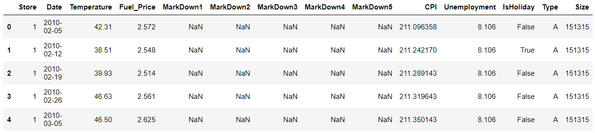

# 날짜 처리

> pandas 관련 날짜 처리하는 방법에 대해서 알아본다.

아래의 내용은 다음의 데이터를 사용한다.

```python
feat_sto.head(5)
```



```python
feat_sto['Date']
```

```
0       2010-02-05
1       2010-02-12
2       2010-02-19
3       2010-02-26
4       2010-03-05
           ...    
8185    2013-06-28
8186    2013-07-05
8187    2013-07-12
8188    2013-07-19
8189    2013-07-26
Name: Date, Length: 8190, dtype: object
```

* csv 파일을 처음 불러왔을 때 `'Date'` 속성이 `object` 타입으로 받아졌다는 것을 알 수 있다.


### datetime으로 변경

`pd.to_datetime`을 사용해 object(string) 타입을 `datetime` 타입으로 변경한다.

```python
feat_sto['Date'] = pd.to_datetime(feat_sto['Date'])
feat_sto['Date']
```

```
0      2010-02-05
1      2010-02-12
2      2010-02-19
3      2010-02-26
4      2010-03-05
          ...    
8185   2013-06-28
8186   2013-07-05
8187   2013-07-12
8188   2013-07-19
8189   2013-07-26
Name: Date, Length: 8190, dtype: datetime64[ns]
```


### 원하는 속성 가져오기 : object type 또는 int type으로 가져온다.

* #### date

  ```python
  print(feat_sto['Date'].dt.date)
  ```

  ```
  0       2010-02-05
  1       2010-02-12
  2       2010-02-19
  3       2010-02-26
  4       2010-03-05
             ...    
  8185    2013-06-28
  8186    2013-07-05
  8187    2013-07-12
  8188    2013-07-19
  8189    2013-07-26
  Name: Date, Length: 8190, dtype: object
  ```

* #### year

  ```python
  print(feat_sto['Date'].dt.year)
  ```

  ```
  0       2010
  1       2010
  2       2010
  3       2010
  4       2010
          ... 
  8185    2013
  8186    2013
  8187    2013
  8188    2013
  8189    2013
  Name: Date, Length: 8190, dtype: int64
  ```

* #### month

  ```python
  print(feat_sto['Date'].dt.month)
  ```

  ```
  0       2
  1       2
  2       2
  3       2
  4       3
         ..
  8185    6
  8186    7
  8187    7
  8188    7
  8189    7
  Name: Date, Length: 8190, dtype: int64
  ```

* #### day

  ```python
  print(feat_sto['Date'].dt.day)
  ```

  ```python
  0        5
  1       12
  2       19
  3       26
  4        5
          ..
  8185    28
  8186     5
  8187    12
  8188    19
  8189    26
  Name: Date, Length: 8190, dtype: int64
  ```

* #### month_name()

  ```python
  print(feat_sto['Date'].dt.month_name())
  ```

  ```
  0       February
  1       February
  2       February
  3       February
  4          March
            ...   
  8185        June
  8186        July
  8187        July
  8188        July
  8189        July
  Name: Date, Length: 8190, dtype: object
  ```

* #### quarter : 분기

  ```python
  print(feat_sto['Date'].dt.quarter)
  ```

  ```python
  0       1
  1       1
  2       1
  3       1
  4       1
         ..
  8185    2
  8186    3
  8187    3
  8188    3
  8189    3
  Name: Date, Length: 8190, dtype: int64
  ```

* #### weekday(day_of_week) : (월 : 0, 화 : 1 , 수 : 2,  목 : 3, 금 : 4, 토 : 5, 일 : 6)

  ```python
  print(feat_sto['Date'].dt.weekday)
  ```

  ```python
  0       4
  1       4
  2       4
  3       4
  4       4
         ..
  8185    4
  8186    4
  8187    4
  8188    4
  8189    4
  Name: Date, Length: 8190, dtype: int64
  ```

* #### day_name() :  월, 화, 수, 목, 금, 토, 일

  ```python
  print(feat_sto['Date'].dt.day_name())
  ```

  ```python
  0       Friday
  1       Friday
  2       Friday
  3       Friday
  4       Friday
           ...  
  8185    Friday
  8186    Friday
  8187    Friday
  8188    Friday
  8189    Friday
  Name: Date, Length: 8190, dtype: object
  ```

* #### weekofyear : 연 기준 몇주째

  ```python
  print(feat_sto['Date'].dt.weekofyear)
  ```

  ```
  0        5
  1        6
  2        7
  3        8
  4        9
          ..
  8185    26
  8186    27
  8187    28
  8188    29
  8189    30
  Name: Date, Length: 8190, dtype: int64
  ```

  

* #### dayofyear : 연 기준 몇일째

  ```python
  print(feat_sto['Date'].dt.dayofyear)
  ```

  ```
  0        36
  1        43
  2        50
  3        57
  4        64
         ... 
  8185    179
  8186    186
  8187    193
  8188    200
  8189    207
  Name: Date, Length: 8190, dtype: int64
  ```

* #### isocalendar() : year, week, day 정보를 가진 dataframe을 만들어준다.

  ```python
  feat_sto['Date'].dt.isocalendar()
  ```

  

  * 이렇게 만들어진 dataframe으로부터 `year`, `week`, `day` feature들을 가져올 수 있다.

#### 참고

* https://m.blog.naver.com/PostView.nhn?blogId=wideeyed&logNo=221603462366&proxyReferer=https:%2F%2Fwww.google.com%2F

* https://moondol-ai.tistory.com/180

