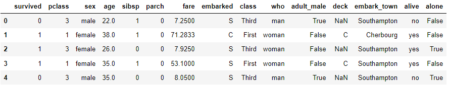
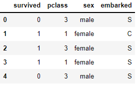
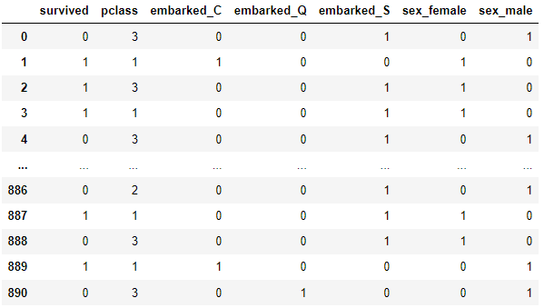
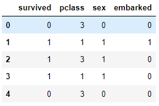
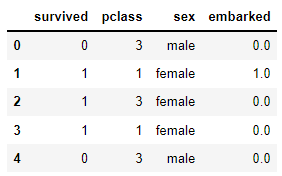

## get_dummies, factorize 및 replace

> 위에서 언급한 세가지 `pandas` 함수를 통해 encoding을 할 수 있다.


* ### library

  ```python
  import numpy as np
  import pandas as pd
  import seaborn as sns
  ```

* ### data

  ```python
  titanic = sns.load_dataset('titanic')
  titanic.head()
  ```

  

  ```python
  df = titanic[['survived', 'pclass', 'sex', 'embarked']]
  df.head()
  ```

  

* ### get_dummies

  * `columns` 키워드를 사용해 `one-hot encoding`으로 쉽게 변환할 수 있다.

  * `sex`, `embarked`에 `get_dummies`를 적용해본다.

    ```python
    pd.get_dummies(df, columns=['embarked', 'sex'])
    ```

    

    * class 개수 만큼의 column이 생성 되고 `one-hot`으로 바뀐다.

* ### factorize

  * `series`에 적용해야 한다.

  * 따라서 `sex`, `embarked`에 `factorize`를 순차 적용해본다.

    ```python
    sex_encoded, sex_label = pd.factorize(df['sex'])
    df['sex'] = sex_encoded
    embarked_encoded, embarked_label = pd.factorize(df['embarked'])
    df['embarked'] = embarked_encoded
    print(sex_label, embarked_label)
    # Index(['male', 'female'], dtype='object') Index(['S', 'C', 'Q'], dtype='object')
    ```

    ```python
    df.head()
    ```

    

* ### replace

  * `factorize`를 대신해 labeling을 `replace`를 사용해 간편하게 바꿀 수 있다.

  * `embarked` column에만 적용해 본다.

    ```python
    df.head()
    ```

    

    ```python
    df.embarked.unique()  # array(['S', 'C', 'Q', nan], dtype=object)
    df = df.replace(['S', 'C', 'Q'], [0, 1, 2])
    df.head()
    ```

    

    ```python
    df.embarked.unique() # array([ 0.,  1.,  2., nan])
    ```

    * 'S' → 0, 'C'→1, 'Q'→2 로 Labeling을 수행했다.

