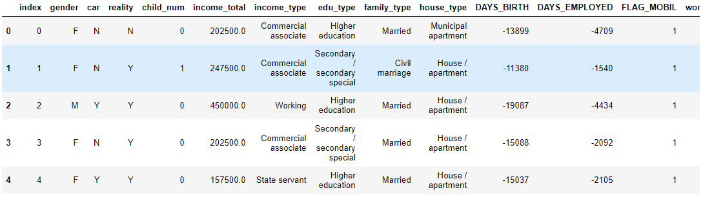

## get_dummies

> DataFrame의 범주형을 One-Hot형태로 바꿔주는 pandas 함수이다. 예제를 통해 사용법을 알아본다.


* ### libray

  ```python
  import warnings
  warnings.filterwarnings("ignore")
  
  import numpy as np
  import pandas as pd
  ```

  

* ### Data

  ```python
  BASE_DIR = './data' 
  
  train_path = os.path.join(BASE_DIR, 'train.csv')
  data = pd.read_csv(train_path) 
  data.head(5)
  ```

  


* ### category columns 지정

  ```python
  cat_cols = [c for c, d in zip(data.columns, data.dtypes) if d=='O']
  print(cat_cols)
  # ['gender', 'car', 'reality', 'income_type', 'edu_type', 'family_type', 'house_type', 'occyp_type']
  ```

  

* ### get_dummies

  * 사용 할 parameter

    * `data ` : one-hot으로 바꿀 `DataFrame ` 또는 `Series`
    * `prefix` : one-hot 컬럼명에 붙일 접두사, 하나 하나 바꿀 때 사용한다.
    * `prefix_sep` : `prefix`붙인고 사용할 구분자, default는 `_` 이다.
    * `columns` : `DataFrame`이 `data`일 경우 one-hot으로 바꿀 컬럼명

  * 변환

    ```python
    data_trans = pd.get_dummies(data, columns=cat_columns)
    data_trans.columns
    ```

    ```python
    ##  결과
    Index(['index', 'child_num', 'income_total', 'DAYS_BIRTH', 'DAYS_EMPLOYED',
           'FLAG_MOBIL', 'work_phone', 'phone', 'email', 'family_size',
           'begin_month', 'gender_F', 'gender_M', 'car_N', 'car_Y', 'reality_N',
           'reality_Y', 'income_type_Commercial associate',
           'income_type_Pensioner', 'income_type_State servant',
           'income_type_Student', 'income_type_Working',
           'edu_type_Academic degree', 'edu_type_Higher education',
           'edu_type_Incomplete higher', 'edu_type_Lower secondary',
           'edu_type_Secondary / secondary special', 'family_type_Civil marriage',
           'family_type_Married', 'family_type_Separated',
           'family_type_Single / not married', 'family_type_Widow',
           'house_type_Co-op apartment', 'house_type_House / apartment',
           'house_type_Municipal apartment', 'house_type_Office apartment',
           'house_type_Rented apartment', 'house_type_With parents',
           'occyp_type_Accountants', 'occyp_type_Cleaning staff',
           'occyp_type_Cooking staff', 'occyp_type_Core staff',
           'occyp_type_Drivers', 'occyp_type_HR staff',
           'occyp_type_High skill tech staff', 'occyp_type_IT staff',
           'occyp_type_Laborers', 'occyp_type_Low-skill Laborers',
           'occyp_type_Managers', 'occyp_type_Medicine staff',
           'occyp_type_Private service staff', 'occyp_type_Realty agents',
           'occyp_type_Sales staff', 'occyp_type_Secretaries',
           'occyp_type_Security staff', 'occyp_type_Waiters/barmen staff'],
          dtype='object')
    ```

    

