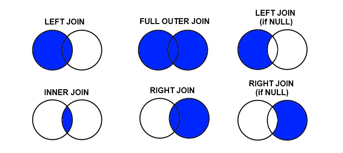

# DataFrame의 결합(1)

>두 DataFrame을 Database 결합(join)하기 위해서는 두개의 DataFrame과 기준(`on`), 방법(`how`) 옵션이 들어간다. 다음의 예제를 통해 여러가지 방법에 대해서 알아본다.



```python
import numpy as np
import pandas as pd 
data1 = {'학번' : [1, 2, 3, 4],
        '이름' : ['이지안','박동훈','이순신','강감찬'],
        '학년' : [2, 4, 1, 3]}


data2 = {'학번' : [1, 2, 4 ,5],
         '학과' : ['CS','MATH','MATH', 'CS'],
         '학점' : [3.4, 2.9, 4.5, 1.2]}
df1 = pd.DataFrame(data1)
df2 = pd.DataFrame(data2)
display(df1)
display(df2)
```


## outer join

> Outer join에는 

