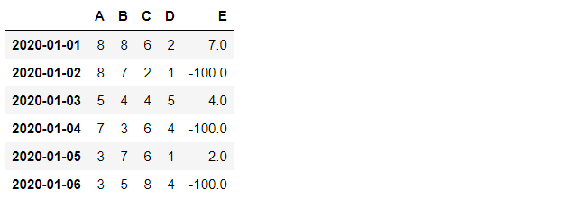

# 결측치 다루기

> Data에서 결측치를 Pandas에서는`NaN` 으로 표현하고 `pandas.nan`값으로 입력할 수있다.
>
> 결측치를 포함하는 data를 다룰때 값을 삭제하거나 대체해서 사용해야 한다. 이를 위해 필요한 `function`들에 대해서 알아본다.


## 1. dropna

> `dropna`라는 method를 사용해서 `NaN`값을 포함한 data를 삭제한다.
>
> option으로는 `how`(any/all), `inplace`(원본 삭제), `index`가 입력된다.

```python
np.random.seed(2)
df =pd.DataFrame(np.random.randint(0,10,(6,4)))
df.columns = ['A','B','C','D']
df.index = pd.date_range('20200101',periods=6)
df['E'] = [7, np.nan, 4, np.nan, 2, np.nan]
display(df)
```


* `how='any'` : row에 하나라도 `NaN`값이 있으면 삭제한다.

```python
display(df.dropna(how='any', inplace=False))
```


* `how='all'` : row에 모든 값이 `NaN`값이면 삭제한다.

```python
display(df.dropna(how='all', inplace= False))
```


* `axis = 1`


## 2.  fillna

> 결측치를 다른값으로 대체하는 방법이다.


```python
nwe_df = df.fillna(value=0)
```


```python
nwe_df = df.fillna(value=10)
```


## 3. replace

> `fillna`와 다르게 원하는값 모두를 다른값 바꿔줄 수 있다.


```python
result = df.replace(np.nan,-100)
display(result)
```




## 4. 결측치행 추출하기 또는 제외하기

> `isnull` 과 `notnull`을 사용해 boolean mask를 만든 후 `NaN`이 있는 행과 `NaN`이 없는 행 각각 추출가능하다.

* `isnull`


```python
my_mask = df['E'].isnull()
display(df.loc[my_mask,:])
```


* `notnull`

```python
my_mask = df['E'].notnull()
display(df.loc[my_mask,:])
```


