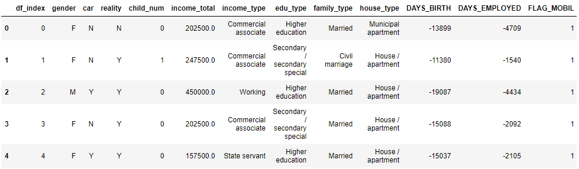
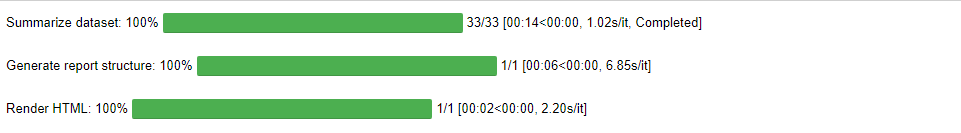
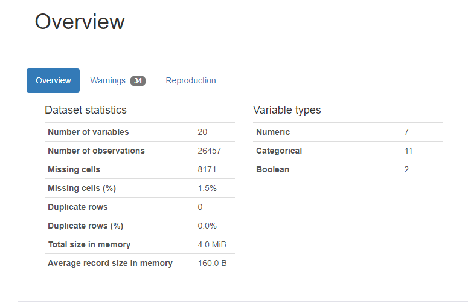
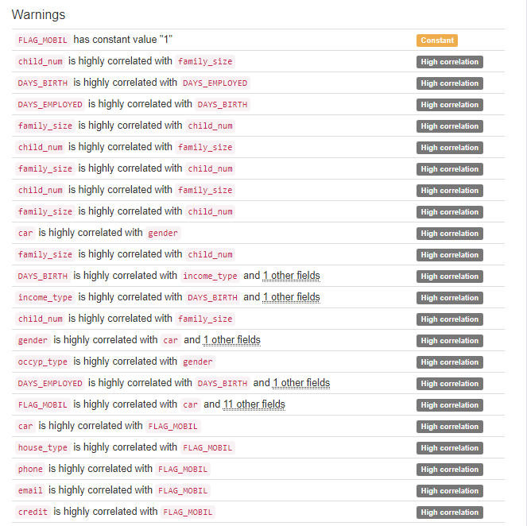
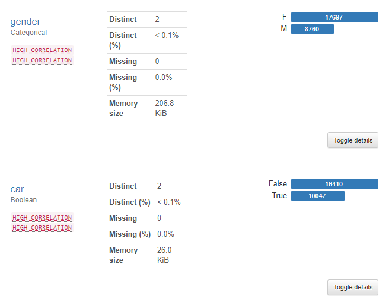
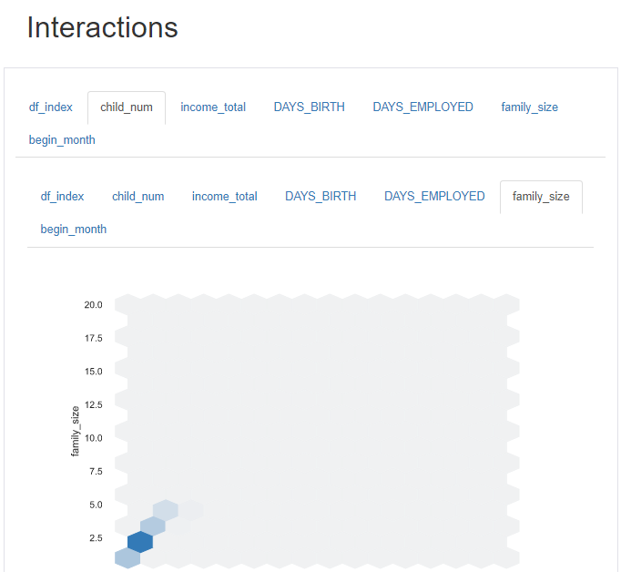
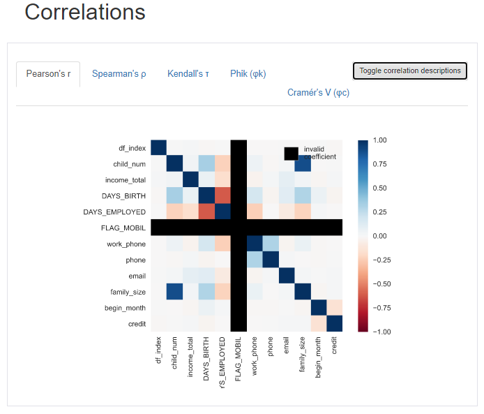

## pandas_profileReport

> Auto EDA 라이브러리를 간단히 소개한다.


* ### Data

  ```python
  BASE_DIR = './data' 
  train_path = os.path.join(BASE_DIR, 'train.csv')
  train = pd.read_csv(train_path)
  train.head()
  ```

  


* ### 설치

  ```python
  pip install pandas_profiling
  ```

  

* ### 불러오기 및 실행

  ```python
  from pandas_profiling import ProfileReport
  profile = ProfileReport(train, title='신용카드 사용 연체 예측')
  profile
  ```

  * 아래와 같이 결과를 불러오는 진행과정을 알려준다.

    

  * 네비게이션

    


* ### Overview

  * Overview : 데이터 정보를 간단히 알려준다.

    

   * Warnings : 데이터의 문제점을 알려준다.

     

* Variables : 컬럼명 데이터 정보를 알려준다.

  

* Interactions : 두 변수간의 관계를 볼 수 있다.

  

* Correlations : 상관관계를 볼 수 있다.

  

