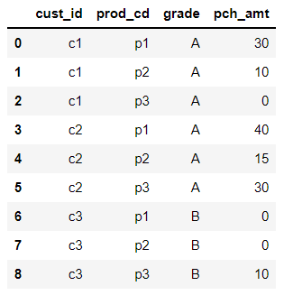
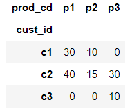
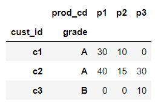
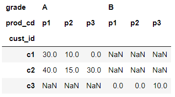
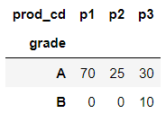
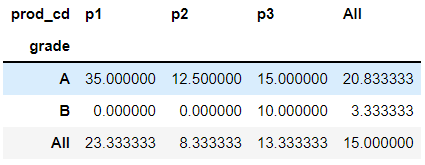

# pivot_table

> dataframe을 재구조화 하는 pivot에  연산을 추가해 dataframe을 만들어 준다.


* #### 데이터

  ```python
  import pandas as pd
  df = pd.DataFrame({'cust_id': ['c1', 'c1', 'c1', 'c2', 'c2', 'c2', 'c3', 'c3', 'c3'],
                     'prod_cd': ['p1', 'p2', 'p3', 'p1', 'p2', 'p3', 'p1', 'p2', 'p3'],
                     'grade' : ['A', 'A', 'A', 'A', 'A', 'A', 'B', 'B', 'B'],
                     'pch_amt': [30, 10, 0, 40, 15, 30, 0, 0, 10]})
  df
  ```

  

* #### 기본 문법

  ```python
  pandas.pivot_table(data, 
                     values=None, index=None, columns=None, aggfunc='mean', 
                     fill_value=None, margins=False, dropna=True, margins_name='All', observed=False)
  ```

  


* #### 예제(1) 

  ```python
  df.pivot_table(index = 'cust_id', columns='prod_cd', values='pch_amt')
  ```
  
  
  
  * default가 `mean`이지만 unique한 값들이기 때문에 pivot만 사용했을때와 같은 결과이다.

* #### 예제(2) : index가 2개 이상일 경우

  ```python
  df.pivot_table(index=['cust_id', 'grade'], columns='prod_cd', values='pch_amt')
  ```
  
  
  
* #### 예제(3) : column이 2개 이상일 경우

  ```python
  df.pivot_table(index='cust_id', columns=['grade', 'prod_cd'], values='pch_amt')
  ```

  

* #### 예제(4) : 집계함수 sum인 경우

  ```python
  df.pivot_table(index='grade', columns='prod_cd', values='pch_amt',aggfunc='sum')
  ```

  

* #### 예제(5) : margins 활용하면 모든 경우에 대해 집계함수 결과를 알려준다.

  ```sql
  df.pivot_table(index='grade', columns='prod_cd', values='pch_amt', aggfunc='mean', margins=True)
  ```

  

