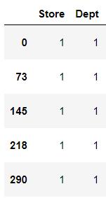
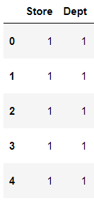
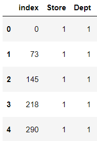

# reset_index

> DataFrame의 index를 재배열하는 `reset_index`에 대해 알아본다.


* ### 기본구조

  ```python
  DataFrame.reset_index(level=None, drop=False, inplace=False, col_level=0, col_fill='')
  ```

  * level : multiIndex를 사용할 때 지우고 싶은  index를 설정하면 되지만 Default로 모든 index를 지운다.
  * drop : default False
    * True → 기존 Index를 제거한다.
    * False → 기존 Index를 새로운 `index` 라는  Column으로 가져온다.
  * inplace : default False
    * True → 기존  DataFrame을 변경
    * False → 새로운 DataFrame을 변경 


* ### 예제

  ```python
  df
  ```

  

  * drop=True

    ```python
    df.reset_index(drop=True).head()
    ```

    

  * drop=False

    ```python
    df.reset_index(drop=False).head()
    ```

    

