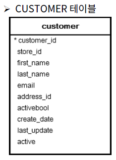

* ### 실습문제 1

  `PAYMENT` 테이블에서 단일 거래의 AMOUNT의 액수가 가장 많은 고객들이 CUSTOMER_ID를 추출하라.

  단 `CUSOTMER_ID`의 값은 유일해야 한다.

  

  ```SQL
  SELECT 
  	DISTINCT CUSTOMER_ID, AMOUNT
  FROM PAYMENT
  where AMOUNT =
  (select MAX(AMOUNT) from PAYMENT);
  ```

  OR

  ```SQL
  SELECT 
  	DISTINCT CUSTOMER_ID, AMOUNT
  FROM PAYMENT
  where AMOUNT =
  (select 
  	AMOUNT 
  from 
  	PAYMENT
  order by 
  	AMOUNT desc
  limit 1);
  ```


* ### 실습문제 2

  고객들에게 단체 이메일을 전송 하고자 한다. CUSTOMER 테이블에서 고객의 EMAIL주소를 추출하고, 이메일 형식에 맞지 않는 이메일 주소는 제외시켜라. (이메일 형식은 '@'가 존재해야 하고 '@'로 시작하지 말아야 하고 '@'로 끝나지 말아야 하다.)

  

  ```SQL
  SELECT 
  	EMAIL
  FROM 
  	CUSTOMER
  WHERE (EMAIL NOT LIKE '@%') AND (EMAIL NOT LIKE '%@') AND (EMAIL LIKE '%@%')
  ;
  ```

  

