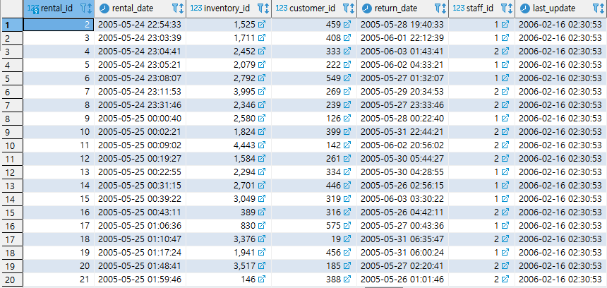
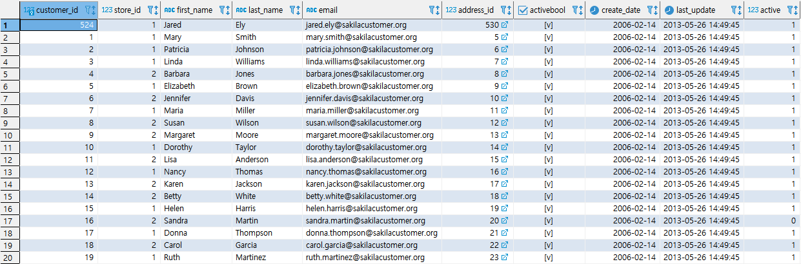

* ###  실습문제 2

1.`RENTAL`과 `CUSTOMER` 테이블을 이용하여 현재까지 가장 많이 RENTAL을 한 고객의 고객ID, 렌탈순위, 누적렌탈횟수, 이름을 출력하라.

  ```SQL
  SELECT * FROM RENTAL;
  ```

   

  ```SQL
  SELECT * FROM CUSTOMER;
  ```

  

  ```SQL
  SELECT 
  	A.CUSTOMER_ID,
  	ROW_NUMBER() OVER (ORDER BY COUNT(A.CUSTOMER_ID) DESC) AS RENTAL_RATE,
  	COUNT(A.CUSTOMER_ID) AS RENTAL_COUNT,
  	MAX(B.FIRST_NAME) AS FIRST_NAME, 
  	MAX(B.LAST_NAME) AS LAST_NAME
  FROM RENTAL A
  INNER JOIN CUSTOMER B
  ON (A.CUSTOMER_ID = B.CUSTOMER_ID)
  GROUP BY A.CUSTOMER_ID
  ORDER BY COUNT(A.CUSTOMER_ID) DESC LIMIT 1;
  ```

  * OVER 다음에 PARTITION BY 가 없어도 된다.
  * GROUP BY 사용했을 때 이름 출력하려면 MAX를 사용한다.

2. `RENTAL` 테이블을 이용해 연, 연월, 연월일, 전체 각각의 기준으로 RENTAL_ID 기준 렌탈이 일어난 횟수를 출력하라.

   ```SQL
   select 
   	TO_CHAR(RENTAL_DATE, 'YYYY'),
   	TO_CHAR(RENTAL_DATE, 'MM'),
   	TO_CHAR(RENTAL_DATE, 'DD'),
   	COUNT(RENTAL_ID)
   from RENTAL
   group by 
   rollup
   (
   	TO_CHAR(RENTAL_DATE, 'YYYY'),
   	TO_CHAR(RENTAL_DATE, 'MM'),
   	TO_CHAR(RENTAL_DATE, 'DD')
   );
   
   ```

   