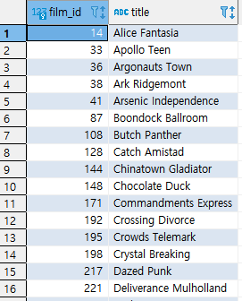
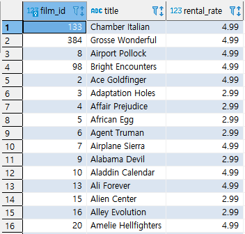

* ### 실습 3

(1) 아래 SQL문을 EXCEPT연산을 사용하지 말고 같은 결과를 도출하라.

```SQL
SELECT 
	FILM_ID, TITLE
FROM FILM
EXCEPT 
(SELECT DISTINCT INVENTORY.FILM_ID, TITLE
FROM INVENTORY
INNER JOIN FILM
ON FILM.FILM_ID = INVENTORY.FILM_ID)
ORDER BY TITLE;
```

* NOT EXSITS 이용

  ```SQL
  SELECT
  	FILM_ID, TITLE
  FROM FILM F
  WHERE NOT EXISTS
  (
  SELECT 1
      FROM INVENTORY I
      WHERE F.FILM_ID = I.FILM_ID
  ) 
  ORDER BY TITLE;
  ```

  


(2) 아래 SQL문을 FILM 테이블을 2번이나 스캔하고 있다. FILM 테이블을 한번만 SCAN하여 동일한 결과 집합을 구하는 SQL을 작성하라.

```SQL
SELECT
	FILM_ID, TITLE, RENTAL_RATE
FROM FILM
WHERE RENTAL_RATE > 
(
SELECT AVG(RENTAL_RATE)
FROM FILM
);
```

* 분석함수 AVG와 인라인 뷰를 사용한다.

  ```SQL
  SELECT A.FILM_ID, A.TITLE, A.RENTAL_RATE
  FROM
  (SELECT FILM_ID, TITLE, RENTAL_RATE,
          AVG(RENTAL_RATE) over () as AVG_RENTAL_RATE
  from FILM) A
  WHERE A.RENTAL_RATE > A.AVG_RENTAL_RATE;
  ```

  

