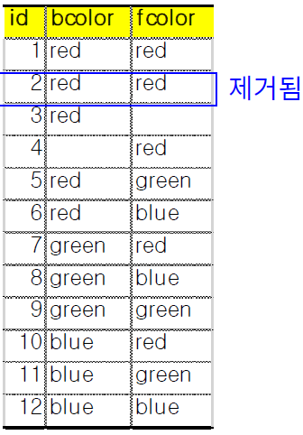
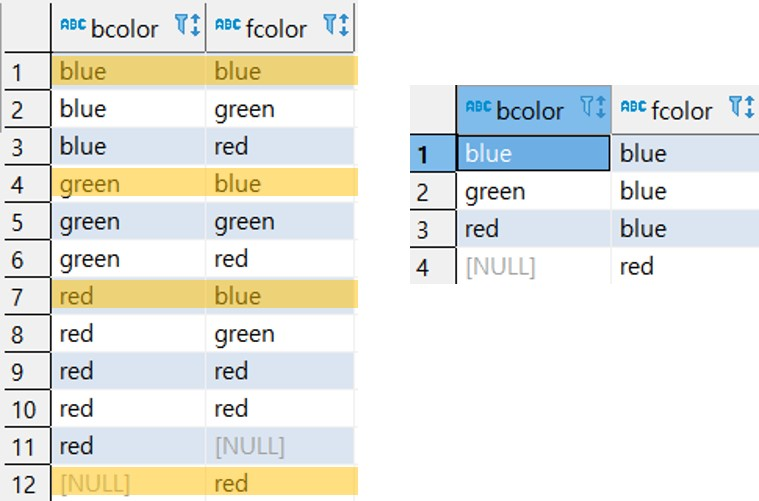
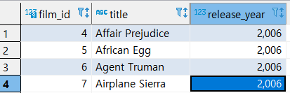

* ###   ORDER BY

  * 예제1 : FIRST_NAME 부터 오름차순, LAST_NAME으로 내림차순

    ```sql
    SELECT
    	FIRST_NAME,
    	LAST_NAME
    FROM
    	CUSTOMER
    ORDER BY FIRST_NAME ASC,
    		 LAST_NAME DESC
    ;
    ```

  * 예제 2: 위의 식에서 `ORDER BY` 뒤에 column 대신 정수로도 불러올 수 있다.

    ```sql
    SELECT
    	FIRST_NAME,
    	LAST_NAME
    FROM
    	CUSTOMER
    ORDER BY 1 ASC,
    		 2 DESC
    ;
    ```

    

* ### SELECT DISTINCT

  * 예제 1 :  BCOLOR + FCOLOR 의 중복값을 없애준다. 예를 들어, (blue, blue), (blue, red) 면 다른 취급을 한다.

    ```sql
    SELECT 
    	DISTINCT BCOLOR, FCOLOR
    FROM 
    	T1
    ORDER BY BCOLOR, FCOLOR
    ```

    

  * 예제 2 : BCOLOR에 대해서 중복을 제거하려면 `DISTINCT ON(column)`을 사용한다.

    ```sql
    SELEC
    	DISTINCT ON(BCOLOR)
    	BCOLOR, FCOLOR
    FROM
    	T1
    ORDER BY BCOLOR, FCOLOR
    ```

    

* ### LIMIT

  * 예제1 : `OFFSET`과 함께 지정이 가능하다. 여기서는 3을 지정했는데 그러면 4번 부터 등장하게 된다.

    ```SQL
    SELECT 
    	FILM_ID,
    	TITLE,
    	RELEASE_YEAR
    FROM 
    	FILM
    ORDER BY FILM_ID
    LIMIT 4 OFFSET 3
    ;
    ```

    

