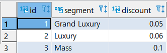
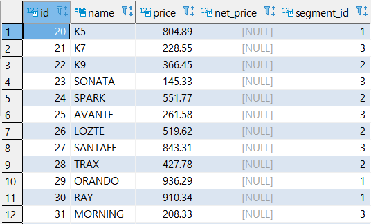
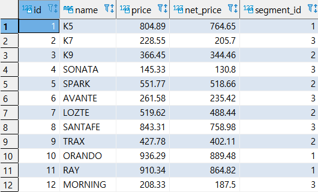

## UPDATE

> 테이블의 존재하는 데이터를 수정하는 작업이다. 업무를 처리하는데 필수적인 것이며 동시성에 유의해야 한다.


* ###  UPDATE 문법

```SQL
UPDATE 
	TABLE_NAME
SET COLUMN1 = VALUE1,
	COLUMN2 = VALUE2
WHERE 조건;
```


#### 실습

* 실습준비

  ```SQL
  ALTER TABLE LINK ADD COLUMN LAST_UPDATE DATE;
  ALTER TABLE LINK ALTER COLUMN LAST_UPDATE SET DEFAULT CURRENT_DATE;
  SELECT * FROM LINK;
  ```

  

  

* 예제(1) : 조건문을 사용한 수정

  ```SQL
  UPDATE
  	LINK
  SET LAST_UPDATE = DEFAULT
  WHERE LAST_UPDATE IS NULL;
  COMMIT;
  
  SELECT * FROM LINK;
  ```

  

  

* 예제(2) : 전체 테이블 수정

   ```SQL
   UPDATE
   	LINK
   SET REL = 'NO DATA';
   COMMIT;
   
   SELECT * FROM LINK;
   ```

  

  

* 예제(3) : 특정 컬럼을 이용

  ```SQL
  UPDATE
  	LINK
  SET DESCRIPTION = NAME
  ;
  COMMIT;
  
  SELECT * FROM LINK
  ```

  

  


* ###  UPDATE JOIN문법

```SQL
UPDATE 
	TARGET_TABLE A
SET COLUMN1 = 표현식
FROM REF_TABLE B
WHERE A.COLUMN_1 = B.COLUMN_1;
```


#### 실습

* 실습준비

  ```SQL
  CREATE TABLE PRODUCT_SEGMENT
  (
  ID SERIAL PRIMARY KEY,
  SEGMENT VARCHAR NOT NULL,
  DISCOUNT NUMERIC (4, 2)
  );
  
  INSERT INTO PRODUCT_SEGMENT
  (SEGMENT, DISCOUNT)
  VALUES
  	('GRAND LUXURY', 0.05),
  	('LUXURY', 0.06),
  	('MASS', 0.1);
  COMMIT;
  
  SELECT * FROM PRODUCT_SEGMENT;
  ```

  

  ```SQL
  CREATE TABLE C_PRODUCT
  (
  ID SERIAL PRIMARY KEY,
  NAME VARCHAR NOT NULL,
  PRICE NUMERIC(10, 2),
  NET_PRICE NUMERIC(10, 2),
  SEGMENT_ID INT NOT NULL,
  FOREIGN KEY(SEGMENT_ID)
  REFERENCES PRODUCT_SEGMENT(ID)
  );
  
  INSERT INTO C_PRODUCT (NAME, PRICE, SEGMENT_ID)
  VALUES
  	('K5', 804.89, 1),
  	('K7', 228.55, 3),
  	('K9', 366.45, 2),
  	('SONATA', 145.33, 3),
  	('SPARK', 551.77, 2),
  	('AVANTE', 261.58, 3),
  	('LOZTE', 519.62, 2),
  	('SANTAFE', 843.31, 3),
  	('TRAX', 427.78, 2),
  	('ORANDO', 936.29, 1),
  	('RAY', 910.34, 1),
  	('MORNING', 208.33, 3),
  	('VERINA', 985.45, 1),
  	('K8', 841.26, 1),
  	('TICO', 896.38, 1),
  	('MATIZ', 575.74, 2),
  	('SPORTAGE', 530.64, 2),
  	('ACCENT', 892.43, 1),
  	('TOSCA', 167.71, 3);
  COMMIT;
  
  SELECT * FROM C_PRODUCT;
  ```

  

  

* 예제 : net_price의 `NULL`값을 PRODUCT_SEGMENT를 이용해 값을 변경한다.

  ```SQL
  UPDATE C_PRODUCT C
  SET NET_PRICE = C.PRICE - (P.DISCOUNT * C.PRICE) 
  FROM PRODUCT_SEGMENT P
  WHERE C.SEGMENT_ID = P.ID
  ```

  

