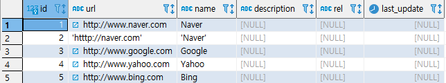
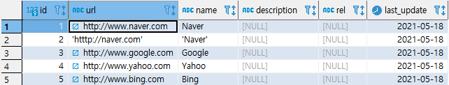
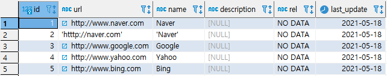

## UPDATE

> 테이블의 존재하는 데이터를 수정하는 작업이다. 업무를 처리하는데 필수적인 것이며 동시성에 유의해야 한다.


* ###  UPDATE 문법

```SQL
UPDATE 
	TABLE_NAME
SET COLUMN1 = VALUE1,
	COLUMN2 = VALUE2
WHERE 조건;
```


* ### 실습

  * 실습준비

    ```SQL
    ALTER TABLE LINK ADD COLUMN LAST_UPDATE DATE;
    ALTER TABLE LINK ALTER COLUMN LAST_UPDATE SET DEFAULT CURRENT_DATE;
    SELECT * FROM LINK;
    ```

    

    

  * 예제(1) : 조건문을 사용한 수정

    ```SQL
    UPDATE
    	LINK
    SET LAST_UPDATE = DEFAULT
    WHERE LAST_UPDATE IS NULL;
    COMMIT;
    
    SELECT * FROM LINK;
    ```

    

    

  * 예제(2) : 전체 테이블 수정

     ```SQL
     UPDATE
     	LINK
     SET REL = 'NO DATA';
     COMMIT;
     
     SELECT * FROM LINK;
     ```

    

    

  * 예제(3) : 특정 컬럼을 이용

    ```SQL
    UPDATE
    	LINK
    SET DESCRIPTION = NAME
    ;
    COMMIT;
    
    SELECT * FROM LINK
    ```

    

    


