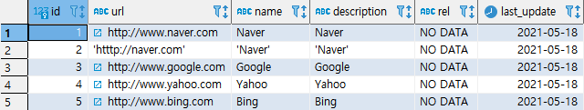
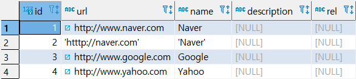
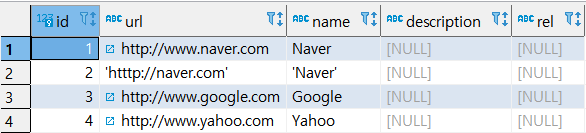
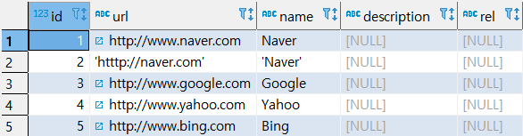
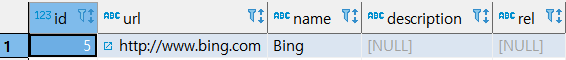
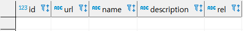

## DELETE

> 테이블에서 특정 데이터를 삭제하거나 테이블 내에 존재하는 모든 데이터를 삭제할 수 있다.


### DELETE 문법

```SQL
DELETE
FROM TARGET_TABLE A
WHERE 조건식
;
```


#### 실습

 * 예제

   ```SQL
   SELECT * FROM LINK;
   ```

   

   ```SQL
   DELETE 
   FROM LINK
   WHERE ID = 5;
   ```

   


### DELETE JOIN 문법

```SQL
DELETE
FROM TARGET_TABLE A
USING REF_TABLE B
WHERE A.COULMN_1 = B.COULMN_1
;
```


#### 실습

* 예제(1)

  ```SQL
  SELECT * FROM LINK;
  SELECT * FROM LINK_TMP;
  ```

  

  

  ```SQL
  DELETE
  FROM LINK_TMP A
  USING LINK B
  WHERE A.ID=B.ID ;
  
  SELECT * FROM LINK_TMP;
  ```

  

* 예제(2) : 전체제거

  ```SQL
  DELETE 
  FROM LINK_TMP;
  
  SELECT * FROM LINK_TMP;
  ```

  

