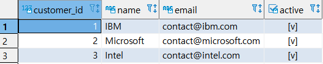
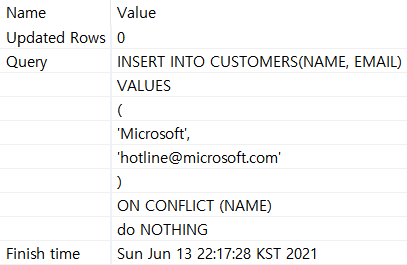
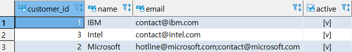

## UPSERT

> INSERT를 시도할 때 조건(상황)에 따라 UPDATE를 할 수 있는  구문이다. 복잡한 업무처리에 주로 사용.


* ###  UPSERT 문법

```SQL
INSERT INTO
	TABLE_NAME(COLOMN_1) VALUES(VALUE_1) -- INSERT 시도
ON CONFLICT TARGET ACTION; -- 충돌 시 다른 액션
```


#### 실습

* 실습준비 : `NAME` COLUMN이 UNIQUE 값이다.

  ```SQL
  CREATE TABLE CUSTOMERS
  (
  CUSTOMER_ID SERIAL PRIMARY KEY,
  NAME VARCHAR UNIQUE,
  EMAIL VARCHAR NOT NULL,
  ACTIVE BOOL NOT NULL DEFAULT TRUE
  );
  
  INSERT INTO CUSTOMERS(NAME, EMAIL)
  VALUES
  	('IBM', 'CONTACT@IBM.COM'),
  	('MICROSOFT', 'CONTACT@MICROSOFT.COM'),
  	('INTEL', 'CONTACT@INTEL.COM');
  COMMIT;
  
  SELECT * FROM CUSTOMERS;
  ```

  

* 예제 (1) : DO NOTHING : 문제시 아무것도 안함

  ```SQL
  INSERT INTO CUSTOMERS(NAME, EMAIL)
  VALUES
  (
  'Microsoft',
  'hotline@microsoft.com'
  )
  ;
  ```

  

  ```sql
  INSERT INTO CUSTOMERS(NAME, EMAIL)
  VALUES
  (
  'Microsoft',
  'hotline@microsoft.com'
  )
  ON CONFLICT (NAME)
  DO NOTHING;
  ```

  

  : ERROR가 발생하지 않는다.

* 예제 (2) : UPSERT : 문제시 UPDATE

  ```SQL
  INSERT INTO CUSTOMERS(NAME, EMAIL)
  VALUES
  (
  'Microsoft',
  'hotline@microsoft.com'
  )
  ON CONFLICT(NAME)
  DO UPDATE 
     SET EMAIL = EXCLUDED.EMAIL || ';' || CUSTOMERS.EMAIL
  ;
  ```

  

  * EXCLUDED.EMAIL : 추가하고자 하는 이메일이다.


