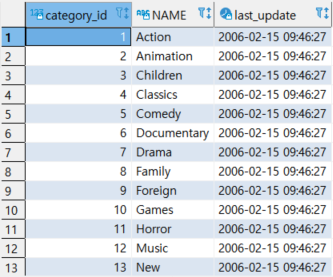
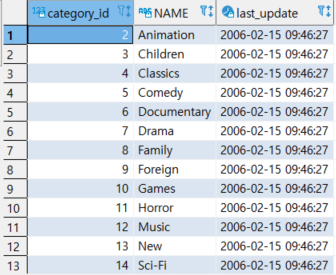

## IMPORT

> IMPORT는 다른 형식의 데이터를 테이블에 넣는 작업이다. 데이터 구축 시 자주 사용 된다.


* #### 실습 준비 : CREATE로 TABLE만 만든다.

  ```SQL
  CREATE TABLE CATEGORY_IMPORT
  (
  CATEGORY_ID SERIAL NOT NULL,
  "NAME" VARCHAR(25) NOT NULL, -- 작은 따옴표는 error
  LAST_UPDATE TIMESTAMP NOT NULL DEFAULT NOW(),
  CONSTRAINT CATEGORY_IMPORT_PKEY PRIMARY KEY (CATEGORY_ID)
  );
  ```

* #### CSV 형태

  ```SQL
  COPY CATEGORY_IMPORT(CATEGORY_ID, "NAME", LAST_UPDATE)
  FROM 'C:\tmp\DB_CATEGORY.csv'
  DELIMITER ','
  CSV HEADER
  ;
  
  SELECT * FROM CATEGORY_IMPORT;
  ```

  

* #### TXT 형태

  ```SQL
  COPY CATEGORY_IMPORT(CATEGORY_ID, "NAME", LAST_UPDATE)
  FROM 'c:\tmp\DB_CATEGORY.txt'
  DELIMITER '|'
  CSV HEADER
  ;
  ```

  

* ### HEADER 없는 CSV

  ```SQL
  COPY CATEOGRY_IMPORT(CATEOGRY_ID, "NAME", LAST_UPDATE) 
  FROM 'c:\tmp\DB_CATEGORY_2.csv'
  DELIMITER ','
  CSV;
  ```

  

* #### HEADER 없는 파일 HEADER 인식해 IMPORT : 1행이 날라간다.

  ```SQL
  COPY CATEOGRY_IMPORT(CATEOGRY_ID, "NAME", LAST_UPDATE) 
  FROM 'c:\tmp\DB_CATEGORY_2.csv'
  DELIMITER ','
  CSV HEADER;
  ```

  

