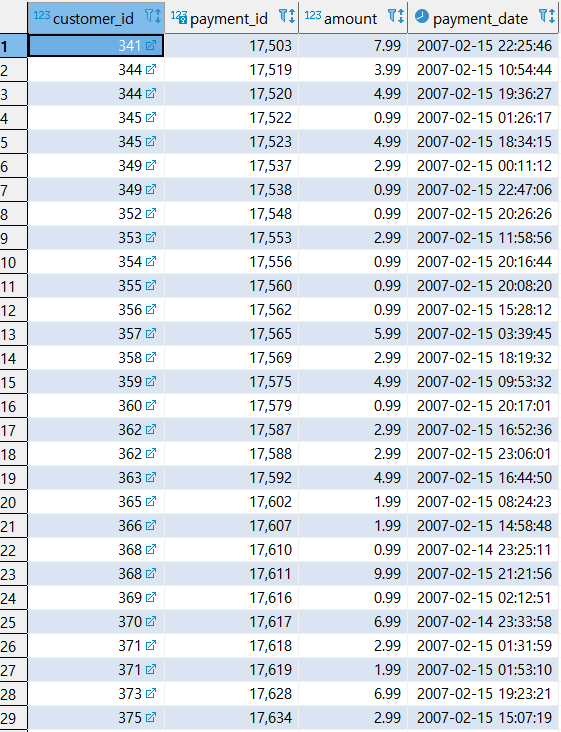

* ### IN 연산자

  * 예제1 : 2005-05-27년도에 RENTAL을 한 사람의 이름을 출력한다.

    ```SQL
    select 
    	FIRST_NAME, LAST_NAME
    from 
    	CUSTOMER 
    where CUSTOMER_ID IN 
    (select 
    	CUSTOMER_ID
    from 
    	RENTAL 
    where
    	cast(RETURN_DATE as DATE)='2005-05-27');
    ```

    

* ### BETWEEN 연산자

  * 예제 1 : 2007-02-07 ~ 2007-02-15 년도에 RENTAL 한 사람의 정보를 가져온다.

    ```SQL
    select 
    	CUSTOMER_ID, PAYMENT_ID,
    	AMOUNT, PAYMENT_DATE
    from 
    	PAYMENT
    where
    	CAST(PAYMENT_DATE as DATE)
    	BETWEEN'2007-02-07' AND '2007-02-15';
    ```

     


* #### LIKE 연산자 : `%`는 어떤 문자 혹은 문자열 매칭, `_`는 한 개의 문자를 매칭한다. NOT LIKE도 사용가능하다.

  * 예제 1 : first_name의 맨 앞이 Jen인 사람 

    ```SQL
    select
    	FIRST_NAME, LAST_NAME
    from
    	customer
    where 
    	FIRST_NAME like 'Jen%'
    ```

    

  * 예제 2 : first_name에 er이 들어가는 사람

    ```sql
    SELECT
    	FIRST_NAME, last_name
    from 
    	customer
    where FIRST_NAME like '%er%';
    ```

    

  * 예제 3 : 두번째 글자부터 her이 들어가는 사람

    ```sql
    select 
    	first_name, last_name
    from
    	customer
    where 
    	first_name like '_her%';
    ```

    

